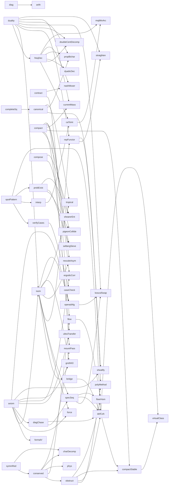

# 10. The Mathematician's Toolbox

## Techniques as functions, organized as a tree

Chapter 9 describes discovery techniques in prose. This chapter re-presents the same 27 techniques as a **structured toolbox** — a catalog you can browse like a standard library's documentation:

- Each technique has a **function signature** with declared inputs, process, outputs, preconditions, and postconditions.
- Techniques are organized as a **tree** (cluster → technique → sub-variant) and a **directed graph** (inheritance edges showing which techniques build on which).
- A **decision flowchart** at the end helps pick the right technique for a new problem.

Read this chapter as a reference, not linearly.

---

## 1. The tree of discovery

All 27 techniques grouped under the 10 clusters. Each leaf is a callable tool.

```mermaid
flowchart TB
  ROOT((Mathematical<br/>Discovery))

  ROOT --> C1[Cluster 1<br/>Experimental &<br/>Numerical]
  ROOT --> C2[Cluster 2<br/>Algebraic<br/>Manipulation]
  ROOT --> C3[Cluster 3<br/>Symmetry &<br/>Invariants]
  ROOT --> C4[Cluster 4<br/>Approximation<br/>& Limits]
  ROOT --> C5[Cluster 5<br/>Abstraction &<br/>Axiomatization]
  ROOT --> C6[Cluster 6<br/>Topology &<br/>Obstruction]
  ROOT --> C7[Cluster 7<br/>Self-Reference<br/>& Impossibility]
  ROOT --> C8[Cluster 8<br/>Iteration &<br/>Fixed Points]
  ROOT --> C9[Cluster 9<br/>Cross-Field<br/>Transfer]
  ROOT --> C10[Cluster 10<br/>Computer &<br/>Collaboration]

  C1 --> spotPattern[spotPatternInTable]
  C1 --> verifyCases[verifyOnSpecialCases]

  C2 --> completeSq[completeTheSquare]
  C2 --> canonical[reduceToCanonicalForm]
  C2 --> compose[composeWithIdentity]

  C3 --> symmRed[symmetryReduction]
  C3 --> conserved[conservedQuantity]
  C3 --> duality[duality]

  C4 --> exhaust[exhaustionSqueeze]
  C4 --> interp[interpolateAndContinue]
  C4 --> freqDec[frequencyDecomposition]

  C5 --> axiom[axiomatizeFromInstances]
  C5 --> isom[structuralIsomorphism]

  C6 --> raiseDim[raiseDimension]
  C6 --> obstruct[obstructionClass]
  C6 --> compact[compactnessArgument]

  C7 --> diag[diagonalize]
  C7 --> arith[arithmetizeSyntax]
  C7 --> force[forceIndependence]

  C8 --> contract[contractionFixedPoint]
  C8 --> descent[infiniteDescent]
  C8 --> flow[flowWithSurgery]

  C9 --> phys[physicsToPDE]
  C9 --> caToInt[complexAnalysisToIntegers]
  C9 --> bridge[analysisAlgebraTopologyBridge]

  C10 --> caseCheck[finiteCaseCheck]
  C10 --> formalV[formalVerify]
  C10 --> distrib[distributedCollaboration]

  ROOT --> C11[Cluster 11<br/>Probabilistic &<br/>Counting]
  ROOT --> C12[Cluster 12<br/>Homological &<br/>Categorical]

  C5 --> ultraTransfer[ultraproductTransfer]

  C11 --> probExist[probabilisticExistence]
  C11 --> pigeonCollide[pigeonholeCollision]
  C11 --> polyMethod[polynomialMethod]

  C12 --> specSeq[spectralSequenceCompute]
  C12 --> diagChase[diagramChase]
  C12 --> repFunctor[representableFunctorTrick]

  C3 --> charDecomp[characterDecompositionCount]
  C3 --> doubleCentDecomp[doubleCentralizerDecompose]
  C3 --> koszulSwap[koszulDualOperadSwap]

  C4 --> dyadicDec[dyadicDecomposition]
  C4 --> propBichar[propagateSingularityAlongBicharacteristic]

  C6 --> defCoh[deformationCohomology]
  C6 --> compactStable[compactifyByStableDegenerations]
  C6 --> currentMass[currentMassMinimize]
  C6 --> rescaleAsym[rescaleForAsymptoticGeometry]

  C8 --> mountPass[mountainPassMinimax]
  C8 --> nashMoser[nashMoserFastNewton]

  C9 --> majMinArc[majorMinorArcDecomposition]
  C9 --> ergodicCorr[ergodicCorrespondence]
  C9 --> tropical[tropicalize]

  C11 --> selbergSieve[sieveByOptimizedQuadratic]
  C11 --> shearerEnt[shearerEntropyCount]

  C12 --> grothK0[groupCompleteExactCategory]
  C12 --> straighten[straightenUnstraighten]
  C12 --> sheafify[sheafifyOnGrothendieckTopology]
  C12 --> operadAlg[recognizeStructureAsOperadAlgebra]
  C12 --> virtualClass[virtualClassFromObstructionTheory]
  C12 --> floerHom[floerHomologyFromHolomorphicStrips]
```



---

## 2. Function dictionary

Every technique is listed below with a uniform schema:

```
name(inputs) → outputs
  category:  which cluster
  preconds:  what must be true to apply
  process:   ordered steps
  postconds: what is produced / guaranteed
  inherits:  other techniques this depends on
  examples:  historical theorems that used it
```

---

### Cluster 1 — Experimental & Numerical

#### `spotPatternInTable(data) → conjecture`
- **category:** Cluster 1 · experimental
- **preconds:** you can enumerate or compute enough examples to form a table
- **process:**
  1. Compute `f(n)` or measure `P(instance)` for as many inputs as feasible.
  2. Stare at the table; compute ratios, differences, logs, second differences.
  3. Guess a closed form or asymptotic; round to nearby known constants.
  4. Verify the guess on inputs not used to derive it.
- **postconds:** a named conjecture `C` with concrete numerical agreement to *k* decimals.
- **inherits:** — (foundational)
- **examples:** Aryabhata's sine table via second-difference recurrence (Ch. 1); Gauss's π(x) ≈ x/ln(x) from prime tables (Ch. 4); Euler's Basel sum 1.6449… → π²/6 (Ch. 3); Gauss's quadratic reciprocity (Ch. 3); Kepler's T² ∝ a³ from Tycho's data (Ch. 2); Jia Xian / Yang Hui binomial triangle (c. 1050 / 1261, MacTutor *Yang Hui*) — tabulating binomial coefficients reveals C(n,k) = C(n−1,k−1) + C(n−1,k); Virahaṅka–Hemachandra sequence (c. 600, Virahaṅka) — mātrā-meter counts reveal M(n) = M(n−1) + M(n−2), earliest documented linear recurrence (Singh, *Historia Mathematica* 1985); Euler's pentagonal number theorem (1741 discovered, 1750 proved) — pentagonal-exponent pattern in ∏(1 − xⁿ) spotted after tabulating ~300 cases (Bell, *Arch. Hist. Exact Sci.* 2010); Viro patchworking (Viro 1984, arXiv:math/0611382) — combinatorial recipe building real algebraic hypersurfaces with prescribed topology from subdivisions of the Newton polytope; produced counterexamples in Hilbert's 16th problem.

#### `verifyOnSpecialCases(conjecture) → refinedConjecture | counterexample`
- **category:** Cluster 1 · experimental
- **preconds:** a conjecture `C` you can test on small / extremal / symmetric instances.
- **process:**
  1. Enumerate special cases: small n, symmetric n, extreme parameters.
  2. For each, test `C`; if it fails, try to modify `C` to accommodate.
  3. Attempt proof on the easiest special case; the proof technique may generalize.
- **postconds:** either refined `C'` with proof of special cases or a counterexample.
- **inherits:** `spotPatternInTable`
- **examples:** FLT for n = 4 (Fermat) → n = 3 (Euler) → n = 5, 7 → Kummer's regular primes → eventual Wiles (Chs. 2, 6); Kepler conjecture — local 2D case by Thue before Hales's 3D (Ch. 6); Goldbach numerical verification to 10³⁰ before Helfgott (Ch. 6).

---

### Cluster 2 — Algebraic Manipulation

#### `completeTheSquare(equation, auxiliary) → solvedEquation`
- **category:** Cluster 2 · algebra
- **preconds:** equation with a quadratic-like imbalance; access to field operations and square roots.
- **process:**
  1. Identify the "almost-square" term and the imbalance.
  2. Add (to both sides) a term that makes the LHS a perfect square.
  3. Take square roots; solve the resulting linear equation.
  4. Generalization: if one auxiliary doesn't suffice (cubic, quartic), introduce a parameter and choose it to force a perfect square on both sides.
- **postconds:** explicit closed-form solution via radicals.
- **inherits:** —
- **examples:** Al-Khwārizmī's quadratic classification (Ch. 1); Cardano's depressed cubic, substitution t = u+v with uv = −p/3 (Ch. 2); Ferrari's quartic via resolvent cubic (Ch. 2); Lagrange's mean value theorem — modify f to match endpoints, apply Rolle (Ch. 3).

#### `reduceToCanonicalForm(object, equivalence) → canonicalRep`
- **category:** Cluster 2 · algebra
- **preconds:** an equivalence relation preserving the property you care about.
- **process:**
  1. Apply changes of basis / substitutions to simplify `object`.
  2. Reach a normal form with the fewest free parameters.
  3. Prove the theorem for the normal form.
  4. Translate the result back via the inverse change of basis.
- **postconds:** theorem on `object` via normal-form representative.
- **inherits:** `completeTheSquare` (special case)
- **examples:** Jordan normal form over ℂ (Ch. 7 catalog); Sylvester's law of inertia for real quadratic forms (Ch. 7 catalog); Hahn–Banach extension within a sublinear-bounded interval (Ch. 5); depressed cubic / quartic (Ch. 2); Li Ye's *tian yuan shu* (1248) — every geometric problem in *Cèyuán Hǎijìng* reduced to a polynomial in a "celestial element" via canonical counting-rod layout; Stevin's decimal-fraction representation (1585, MacTutor *Stevin*) — every real rendered as an infinite decimal; AKS primality test (Agrawal–Kayal–Saxena 2004, *Ann. Math.* 160) — reduces primality to identity testing in ℤ_n[x]/(x^r − 1); Hörmander symbol calculus (1965) — symbol a(x, ξ) as canonical form for a pseudo-differential operator; composition and adjoint become asymptotic expansions.

#### `composeWithIdentity(elements, identity) → newElement`
- **category:** Cluster 2 · algebra
- **preconds:** an algebraic identity showing property P is closed under a binary operation.
- **process:**
  1. Verify the identity on one or two levels.
  2. Given two instances of P, combine them via the identity.
  3. Iterate — build a semigroup/monoid of P-instances.
  4. Reduce a general case to a base case via composition.
- **postconds:** general P-statement proved by reducing to primes or generators.
- **inherits:** —
- **examples:** Diophantus–Brahmagupta two-square identity (Ch. 2); Brahmagupta's *bhāvanā* and Bhāskara's *chakravāla* (Ch. 1); Euler's four-square identity used in Lagrange's proof (Ch. 3); Euler product ∏(1 − p⁻ˢ)⁻¹ = Σ 1/nˢ (Ch. 3); Thābit ibn Qurra's amicable-number rule (9th c., Hogendijk, *Historia Math.* 1985) — parameterized identity M = 2ⁿ·p·q, N = 2ⁿ·r from a prime triple (p, q, r); first nontrivial amicable-pair algorithm; Virahaṅka–Hemachandra recurrence (c. 600) — 2-term additive composition M(n) = M(n−1) + M(n−2) from syllable-length decomposition; Narayana Pandita's cow sequence (1356, MathWorld *NarayanaCowSequence*) — 3-term composition aₙ = aₙ₋₁ + aₙ₋₃ with characteristic root the supergolden ratio; Viète's infinite product for π (1593) — half-angle identity 2cos²(θ/2) = 1 + cos θ iterated ad infinitum; Euler's pentagonal number theorem (1741/1750) — Franklin's 1881 sign-reversing involution gives the combinatorial composition rule on distinct-part partitions; Jacobi triple product identity (1829, Andrews *Theory of Partitions* 1984) — composes Euler products with theta-style sums, unifying q-series and modular forms.

---

### Cluster 3 — Symmetry & Invariants

#### `symmetryReduction(configuration, group G) → orbitRepresentative`
- **category:** Cluster 3 · symmetry
- **preconds:** a group `G` acts on your configuration; the property you want is `G`-invariant.
- **process:**
  1. Identify the symmetry group `G`.
  2. Pass to orbit representatives `config / G`.
  3. Prove the theorem on representatives.
  4. Lift back to arbitrary configurations via `G`.
- **postconds:** theorem on all `G`-equivalent configurations.
- **inherits:** —
- **examples:** Thales via isosceles-twice (Ch. 1); Archimedes' sphere via rotational slices (Ch. 1); Brahmagupta's orthodiagonal quadrilateral (Ch. 1); Noether's theorem — Lie-group action on action integral (Ch. 5).

#### `conservedQuantity(system, transformation) → invariantI`
- **category:** Cluster 3 · symmetry
- **preconds:** an object or process with allowed transformations.
- **process:**
  1. Find a quantity `I` that is unchanged under the transformation.
  2. Prove invariance by checking on generators.
  3. Objects with distinct `I` cannot be equivalent; sum of local `I`s = global constant.
- **postconds:** classification or constraint by `I`.
- **inherits:** `symmetryReduction`
- **examples:** Euler's V − E + F = 2 (Ch. 3); Descartes' angular defect summing to 4π (Ch. 2); Gauss's Theorema Egregium — K is intrinsic (Ch. 4); Noether currents — energy, momentum, charge (Ch. 5); Gauss–Bonnet ∫K dA = 2π·χ (Ch. 4); Atiyah–Singer index = topological index (Ch. 6).

#### `duality(category C, category D) → equivalenceCD`
- **category:** Cluster 3 · symmetry
- **preconds:** two theories with a contravariant structure-preserving correspondence.
- **process:**
  1. Establish the correspondence on objects and morphisms.
  2. Verify it reverses arrows and preserves composition.
  3. Translate a problem from `C` to `D`; solve there; translate back.
- **postconds:** a theorem in one theory yields a theorem in the dual theory.
- **inherits:** —
- **examples:** Menelaus ↔ Ceva (Chs. 1, 7); Desargues ↔ Pascal (Ch. 2); Galois correspondence (Ch. 4); Stone duality (Ch. 5); Gelfand–Naimark (Ch. 7); Poincaré duality Hᵏ ↔ H_{n−k} (Ch. 7); Fourier transform pair; Legendre transform (1787, EoM *Legendre transform*) — canonical involution f ↔ f*; points ↔ tangent lines; (f*)* = f; backbone of Hamiltonian mechanics, convex analysis (Fenchel), and thermodynamic potentials; Geometric morphism of toposes (Lawvere–Tierney 1970, Johnstone *Sketches of an Elephant* vol. A) — f: E → F an adjunction (f*, f_*) with left-exact f* translates geometric-theory models across universes; Cohen forcing = geometric morphism to a Boolean topos; classifying toposes represent geometric theories.

#### `characterDecompositionCount(G-set or G-module V, irreducible characters {χ_π} of G) → multiplicities / orbit count / factorization count`
- **category:** Cluster 3 · symmetry (numerical variant of invariant extraction)
- **preconds:** finite (or compact) group G acting on V; the class function of interest is G-invariant; orthonormal irreducible characters of G are available.
- **process:**
  1. Decompose the regular representation (or the ambient V) into isotypic components via ⟨f, χ_π⟩ = (1/|G|) ∑_{g ∈ G} f(g) χ_π(g̅).
  2. For a counting problem, express the quantity as the inner product of a class function f with a character χ_π (orbit count = ⟨1, 1⟩ via fixed-point count; factorization count = ⟨χ_1 χ_2 χ_3 …, 1⟩).
  3. Evaluate the inner product on the character table: numerical output.
- **postconds:** explicit integer multiplicities / orbit counts / factorization counts.
- **inherits:** `symmetryReduction`, `conservedQuantity`
- **examples:** Frobenius's group-determinant decomposition (1896, MacTutor *Frobenius*) — irreducible-character degrees match factor degrees of the *Gruppendeterminante*; Cauchy–Frobenius–Burnside orbit-counting lemma (Cauchy 1845 / Frobenius 1887 / Burnside 1897; Neumann, *Arch. Math.* 1979) — orbits = (1/|G|) ∑ |Fix(g)|; Selberg trace formula (1956) — character integration on a locally symmetric space Γ\G/K; Diaconis–Shahshahani random-walk mixing (1981) — character bounds control total-variation distance of card-shuffling walks.

#### `doubleCentralizerDecompose(vector space V with commuting actions of A and B) → bimodule decomposition ⊕_i U_i ⊗ W_i`
- **category:** Cluster 3 · symmetry
- **preconds:** semisimple algebras (or groups) A and B commuting on V; V finite-dimensional or Hilbertian with enough integrability for L²(G) cases.
- **process:**
  1. Identify the two commuting actions on V and verify they are mutual centralizers.
  2. Decompose V as an A-module V = ⊕_i U_i ⊗ M_i where U_i are A-irreducibles and M_i are multiplicity spaces.
  3. The double centralizer theorem forces M_i to carry a B-action making M_i = W_i, a B-irreducible; the index i bijects A-irreps appearing with B-irreps appearing.
  4. Transfer information from one side to the other: combinatorics on one side = representation theory on the other.
- **postconds:** labeled bijection between A-irreducibles and B-irreducibles appearing in V, with explicit multiplicities tied to a combinatorial index set.
- **inherits:** `frequencyDecomposition` (Peter–Weyl as Fourier on G), `duality`
- **examples:** Peter–Weyl theorem on L²(G) for compact G (1927, *Math. Ann.* 97; nLab) — L²(G) ≅ ⊕_π V_π ⊗ V_π*; Schur–Weyl duality on (ℂⁿ)^⊗k for GL(n) × S_k (Schur thesis 1901; Weyl *Classical Groups* 1939) — (ℂⁿ)^⊗k ≅ ⊕_λ S^λ(ℂⁿ) ⊗ V_λ indexed by partitions of k; Howe reciprocity for dual pairs in Fock space (Howe 1989); Goodman–Wallach *Symmetry, Representations, and Invariants* (GTM 255).

#### `koszulDualOperadSwap(quadratic operad O) → dual operad O^! with bar-cobar equivalence between O-algebras and O^!-coalgebras`
- **category:** Cluster 3 · symmetry (operadic duality — distinct from generic `duality`)
- **preconds:** operad O presented as ℱ(E)/(R) with E a finite-dim S-module of generators and R a submodule of quadratic relations; operad is binary and quadratic (weight-2 relations).
- **process:**
  1. Dualize the generator S-module: E^! = E^* ⊗ sgn (with Koszul sign twist).
  2. Take annihilator R^⊥ of the relation space R under the natural pairing of weight-2 pieces; define O^! = ℱ(E^!)/(R^⊥).
  3. Build the Koszul complex K(O) = O ⊗ (O^!)^* with differential from the pairing; O is Koszul iff K(O) resolves O.
  4. When O is Koszul, Ext over O-algebras = Tor over O^!-coalgebras; bar-cobar is a Quillen equivalence.
- **postconds:** a matched pair (O, O^!) such that hard computations on one side transport to tractable ones on the other; minimal free resolutions of O-algebras constructible via O^!-coalgebra cobar.
- **inherits:** `duality`, `recognizeStructureAsOperadAlgebra`, `spectralSequenceCompute`
- **examples:** Priddy Koszul duality for associative algebras (1970, *TAMS* 152) — polynomial algebra and exterior algebra mutually Koszul; Ginzburg–Kapranov operadic Koszul duality (1994, *Duke Math. J.* 76) — Assoc^! = Assoc, Comm^! = Lie, Lie^! = Comm; Kontsevich formality of Hochschild cohomology (1997) — HH^*(A) of a smooth commutative algebra is L_∞-quasi-isomorphic to polyvector fields; Beilinson–Ginzburg–Soergel Koszul duality for category O (1996). (Loday–Vallette, *Algebraic Operads*, Grundlehren 346.)

---

### Cluster 4 — Approximation & Limits

#### `exhaustionSqueeze(target, lower, upper) → exactValue`
- **category:** Cluster 4 · approximation
- **preconds:** you can produce sequences `Lₙ ≤ target ≤ Uₙ` where both `Lₙ`, `Uₙ` converge.
- **process:**
  1. Construct inscribed (lower) and circumscribed (upper) approximants.
  2. Show `Uₙ − Lₙ → 0`.
  3. Conclude `target = lim Lₙ = lim Uₙ`.
  4. Variant: bisection — halve the interval containing the target, iterate.
- **postconds:** exact value or closed form.
- **inherits:** —
- **examples:** Archimedes' circle area and sphere volume via 96-gons (Ch. 1); Bolzano–Weierstrass bisection (Ch. 4); Weierstrass approximation — polynomial squeeze in sup-norm (Ch. 4); Riemann integrability; Liu Hui's polygon π (c. 263 CE, Lam & Ang, *Historia Math.* 1986) — inscribed polygon-doubling on a hexagon base with explicit passage to the limit ("cut again and again until one can cut no more"); Zu Chongzhi's 355/113 (5th c.) — 24 576-gon yielding 3.1415926 < π < 3.1415927, a bound that stood 900 years; al-Kāshī's 16-decimal π (1424, Luckey, *Die Rechenkunst bei al-Kashi* 1951) — 3·2²⁸-gon via iterated square-root extraction in sexagesimal; Nilakantha's arctan-series exhaustion proof (c. 1500, Sarma ed. *Tantrasaṅgraha*) — chord-arc squeeze yielding a power series rather than a single real value; Stevin's bisection-based algorithmic IVT (1585) — digit-by-digit location of polynomial roots via decimal interval halving.

#### `interpolateAndContinue(formulaOnN) → formulaOnC`
- **category:** Cluster 4 · approximation
- **preconds:** a formula known for integer arguments you'd like to extend.
- **process:**
  1. Identify a smooth functional recurrence the integer values satisfy.
  2. Pick an interpolation method (falling factorials, ratios, limits).
  3. Extend to real/complex arguments where it still converges.
  4. If the domain has natural boundaries, analytically continue via functional equation.
- **postconds:** extended formula valid on a larger domain.
- **inherits:** `spotPatternInTable`
- **examples:** Wallis's π/2 product from ∫(1−x²)ⁿ dx at n=1/2 (Ch. 2); Newton's generalized binomial C(r, k) (Ch. 2); Taylor series via derivatives-as-shrunken-differences (Ch. 3); Euler's Γ function; Riemann ζ(s) continued from Re(s) > 1 to all of ℂ \ {1} (Ch. 4); Mādhava's arctangent series (c. 1400, MacTutor *Madhava*) — extending Aryabhata's sine-table construction to a full analytic series for arctan, now called the Mādhava–Gregory–Leibniz series; Tracy–Widom distribution (1993–94, arXiv:hep-th/9211141) — Painlevé II transcendent continued as the edge-scaling limit of GUE top eigenvalue. *Inherited: interpolateAndContinue. Added: integrable-systems τ-function technology.*

#### `frequencyDecomposition(function) → {modes, coefficients}`
- **category:** Cluster 4 · approximation
- **preconds:** a complete orthogonal basis (sinusoids, characters, spherical harmonics).
- **process:**
  1. Project `f` onto each basis element via inner product.
  2. Manipulate mode-by-mode (differentiation and integration decouple).
  3. Reassemble via inverse transform.
- **postconds:** problem reduces to algebra on coefficients.
- **inherits:** `duality` (Fourier pair is a duality)
- **examples:** de Moivre's (cos θ + i sin θ)ⁿ (Ch. 3); Euler's e^(iθ) = cos θ + i sin θ (Ch. 3); Fourier series for heat equation (Ch. 4); Laplace's CLT via characteristic functions (Ch. 3); Plancherel L² isometry (Ch. 7); al-Ṭūsī's couple (c. 1247, Ragep ed. *al-Tadhkira* 1993) — linear translation decomposed into two uniform circular modes z(t) = r e^{iωt} + r e^{−iωt}; earliest non-trivial frequency decomposition outside geometry; Jacobi triple product identity (1829) — theta-style Fourier-like decomposition of an infinite product as a lattice sum; Hörmander pseudo-differential operators (1965) — Fourier-multiplier framework with symbol calculus; unifies elliptic, hypoelliptic, wave-propagation theory; Tracy–Widom Airy-kernel Fredholm determinant (1994) — edge spectrum via orthogonal-polynomial expansion; Borcherds / monstrous moonshine q-expansions (1992) — McKay–Thompson series as Hauptmoduln; q-expansion is the frequency decomposition of a vertex operator algebra character; Stein–Tomas restriction theorem (Stein 1967, Tomas 1975, *Bull. AMS* 81) — for S ⊂ ℝⁿ with non-vanishing Gaussian curvature, the restriction operator L^p(ℝⁿ) → L²(S, dσ) is bounded for 1 ≤ p ≤ 2(n+1)/(n+3); curvature as a regularizing condition on frequency support.

#### `dyadicDecomposition(function f on ℝⁿ, smooth partition of unity {ψ_k} in frequency) → scale-localized blocks {Δ_k f}`
- **category:** Cluster 4 · approximation (refinement of `frequencyDecomposition`)
- **preconds:** f ∈ S'(ℝⁿ) (tempered distribution) or a more regular space; smooth bump φ with φ = 1 on |ξ| ≤ 1, φ = 0 on |ξ| ≥ 2; derived dyadic cutoffs ψ_k(ξ) = φ(2^{-k}ξ) − φ(2^{-k+1}ξ) giving ∑ ψ_k = 1.
- **process:**
  1. Define the dyadic blocks Δ_k f via Fourier multiplier ψ_k; f = ∑_k Δ_k f.
  2. Replace L^p-norms of f by the square function ‖(∑ |Δ_k f|²)^{1/2}‖_{L^p}, almost-equivalent for 1 < p < ∞ (Littlewood–Paley / Khintchine).
  3. Analyze operators block-by-block: Bernstein inequalities convert derivatives into scale factors 2^k; differentiation and multiplication become tractable in Besov / Triebel–Lizorkin norms.
  4. Sum blocks back via the square function to recover f-norm estimates.
- **postconds:** scale-localized representation producing p-independent norm equivalences; derivatives replaced by algebraic scaling; paraproducts and multilinear operators linearized.
- **inherits:** `frequencyDecomposition`
- **examples:** Littlewood–Paley square-function theorem (1931/1937) — foundational L^p-block equivalence; Marcinkiewicz multiplier theorem (1939) — dyadic Hörmander–Mihlin multiplier bound; Bony paraproducts (1981) — dyadic linearization of products for nonlinear PDE; Bourgain–Demeter ℓ²-decoupling over dyadic caps (2015, *Annals* 182) — decoupling for functions Fourier-supported on δ-neighborhoods of curved surfaces, yielding Vinogradov Main Conjecture (Bourgain–Demeter–Guth 2016). (Tao, *Math 247A lecture notes*; Grafakos, *Classical Fourier Analysis* ch. 6.)

#### `propagateSingularityAlongBicharacteristic(distribution u, operator P with principal symbol p) → microlocal singular support`
- **category:** Cluster 4 · approximation (microlocal phase-space localization)
- **preconds:** smooth manifold M; properly supported pseudo-differential operator P on M with real principal symbol p homogeneous of positive order; distribution u ∈ D'(M).
- **process:**
  1. Define the wavefront set WF(u) ⊂ T*M ∖ 0 as the conic set of (x, ξ) where the local Fourier transform of a cutoff of u fails polynomial decay in direction ξ.
  2. For Pu = f, note WF(u) ⊂ WF(f) ∪ Char(P), where Char(P) = {p = 0}.
  3. Compute the Hamilton vector field H_p of p on T*M ∖ 0; integrate to obtain bicharacteristic flow on Char(P).
  4. Hörmander's theorem: WF(u) ∖ WF(f) is invariant under the bicharacteristic flow; singularities move along null bicharacteristics.
- **postconds:** microlocal location of singularities of u in phase space; sharp propagation statement explaining sharp light-cone singularities in hyperbolic PDE, tunneling in elliptic theory, boundary diffraction.
- **inherits:** `frequencyDecomposition` (local Fourier analysis), `duality` (T*M as dual phase space), `reduceToCanonicalForm` (Hörmander symbol calculus as canonical form)
- **examples:** Hörmander's propagation theorem (1971, *Acta Math.* 127) — foundational statement; Duistermaat–Hörmander Fourier integral operators II (1972, *Acta Math.* 128) — FIOs as quantizations of canonical transformations; Melrose b-calculus and diffractive propagation at corners; Vasy's N-body Fredholm scattering (2013, arXiv:1012.4391) — propagation in asymptotically hyperbolic settings. (nLab *wave front set*; Grigis–Sjöstrand, *Microlocal Analysis*, LMS 196.)

---

### Cluster 5 — Abstraction & Axiomatization

#### `axiomatizeFromInstances(instances[]) → axiomSystemA`
- **category:** Cluster 5 · abstraction
- **preconds:** multiple concrete phenomena sharing structural features.
- **process:**
  1. List the shared operations and laws across instances.
  2. State them as bare axioms.
  3. Prove theorems from the axioms alone.
  4. Every instance inherits all theorems for free.
- **postconds:** a general theory; each concrete case becomes a corollary.
- **inherits:** —
- **examples:** Euclid's *Elements* (Ch. 1); al-Khwārizmī's six canonical quadratic types (Ch. 1); Hilbert's basis theorem — abstract Noetherian condition (Ch. 5); Noether's isomorphism theorems (Ch. 5); Banach spaces — complete normed vector space (Ch. 5); Zermelo–Fraenkel set theory (Ch. 5); Jyeshthadeva's *Yuktibhāṣā* (c. 1530, Sarma et al. *Gaṇita-Yukti-Bhāṣā* 2008) — first proof-first mathematics textbook in a South Asian vernacular; axiomatizes Kerala-school series methods from concrete numerical instances; Voiculescu's free probability (1985, arXiv:1908.08125) — axiomatizes non-commutative "free independence" from observed operator behavior in L(F_n).

#### `structuralIsomorphism(theory T1, theory T2) → bridge`
- **category:** Cluster 5 · abstraction
- **preconds:** two unrelated-looking theories with a structural correspondence.
- **process:**
  1. Identify the objects and morphisms in each.
  2. Construct a functor (or equivalence) between them.
  3. Transport a hard theorem in `T1` to an easier problem in `T2`.
- **postconds:** theorems on both sides.
- **inherits:** `duality`, `axiomatizeFromInstances`
- **examples:** Galois correspondence subgroups ↔ subfields (Ch. 4); Stone representation — Boolean algebras ↔ Stone spaces (Ch. 5); Gelfand–Naimark — C*-algebras ↔ LCH spaces (Ch. 7); Taniyama–Shimura–Wiles modularity — elliptic curves ↔ modular forms (Ch. 6); Grothendieck's Spec — rings ↔ affine schemes; Zu Geng principle (5th c., Lam & Shen, *Historia Math.* 1985) — cross-section-area function ↔ volume; equal cross-sections imply equal volumes, 11 centuries before Cavalieri; Gauss's 17-gon constructibility (1796, Savitt, Cornell notes) — abelian-group structure of 17th roots of unity ↔ nested quadratic extensions; cyclic Galois group of order 2⁴ diagonalized by a tower of square roots; Hrushovski's geometric Mordell–Lang (1996, J. AMS 9) — model-theoretic Zariski geometry ↔ algebraic-geometric subvariety structure in positive characteristic; Borcherds' monstrous moonshine (1992, Invent. Math. 109) — Monster Lie algebra ↔ modular-form Hauptmoduln ↔ finite simple group bridge.

#### `ultraproductTransfer(family of L-structures (A_i)_{i∈I}, ultrafilter U on I) → limitStructure`
- **category:** Cluster 5 · abstraction-logic
- **preconds:** a family of structures for a first-order language L; an ultrafilter U on the index set I.
- **process:**
  1. Form the set-theoretic product ∏ A_i and quotient by the U-equivalence: (a_i) ~_U (b_i) iff {i : a_i = b_i} ∈ U.
  2. Interpret L-symbols componentwise, noting that ultrafilter decisions make quotients respect Boolean connectives.
  3. By Łoś's theorem, a first-order sentence φ holds in ∏ A_i/U iff {i : A_i ⊨ φ} ∈ U.
  4. Use the transfer principle to move a sentence true "on U-many factors" into a theorem about the ultraproduct, and back (when U is principal or the theorem is first-order absolute).
- **postconds:** a limit structure in which first-order truth is preserved from U-large subsets of the family.
- **inherits:** `axiomatizeFromInstances`, `compactnessArgument`
- **examples:** Łoś's theorem (1955, Jerzy Łoś) — the fundamental transfer principle; (nLab *Los theorem*). Robinson's nonstandard analysis and hyperreals *ℝ (1960/66, Abraham Robinson) — ℝ^ℕ/U gives infinitesimals and infinite elements with first-order transfer. Compactness theorem in first-order logic — one-line corollary via ultraproducts of finite-satisfaction families. Ax–Kochen theorem on p-adic fields (1965) — ultraproduct of ℚ_p across p matches ultraproduct of 𝔽_p((t)). Hrushovski's geometric Mordell–Lang (1996) — model-theoretic Zariski geometries applied to function-field arithmetic.

---

### Cluster 6 — Topology & Obstruction

#### `raiseDimension(problem, +k dims) → problemInHigherSpace`
- **category:** Cluster 6 · topology
- **preconds:** a problem resistant in dimension `n` but tractable when embedded higher.
- **process:**
  1. Embed or extend the problem into dim `n + k` with added structure.
  2. Solve in the higher-dimensional ambient.
  3. Project or restrict the solution back to dim `n`.
- **postconds:** theorem in original dimension, proved via detour.
- **inherits:** —
- **examples:** Desargues 2D theorem proved in 3D (Ch. 2); Gauss's FTA via two real curves in ℝ² crossing (Ch. 3); Faltings — curves via their Jacobian abelian varieties (Ch. 6); Wiles — elliptic curve via its Galois representation (Ch. 6); Perelman — 3-manifolds deformed in infinite-dim metric space (Ch. 6).

#### `obstructionClass(target, invariant) → possibilityOrForbidden`
- **category:** Cluster 6 · topology
- **preconds:** a topological/algebraic invariant that must vanish for the construction to exist.
- **process:**
  1. Define the invariant (degree, characteristic class, Galois group, minor).
  2. Compute it; if nonzero, the construction is impossible.
  3. Often the *impossibility* is the theorem.
- **postconds:** either a construction or a provable obstruction.
- **inherits:** `conservedQuantity`
- **examples:** Brouwer no-retraction — degree(identity S^n) ≠ 0 (Ch. 5); hairy-ball theorem χ(S²) = 2 (Ch. 7); Abel–Ruffini — A₅ non-solvable blocks radical formulas (Ch. 4); Wagner/Robertson–Seymour forbidden minors (Ch. 6); Liouville's transcendentals (1844, Chanillo, Rutgers notes) — being algebraic of degree d forces |α − p/q| ≥ c/q^d; any number exceeding the bound is obstructed from being algebraic; Seiberg–Witten invariants (1994, arXiv:hep-th/9411102) — SW(X, s) distinguishes smooth structures on 4-manifolds; nonzero SW obstructs certain metric/topological properties (e.g., Einstein metrics per LeBrun); Bott periodicity as obstruction collapse (Bott 1959, *Ann. Math.* 70) — π_k(U) = π_{k+2}(U); in any obstruction tower valued in K-theory, infinitely many degrees collapse to two residue classes; equivalently K⁰(X) ≅ K⁻²(X).

#### `compactnessArgument(space) → convergentLimit`
- **category:** Cluster 6 · topology
- **preconds:** a topological space with some form of compactness.
- **process:**
  1. Take a sequence / net / ultrafilter in the space.
  2. Extract a convergent subsequence / accumulation point.
  3. Show the limit has the desired property (closed conditions pass to limits).
- **postconds:** existence of an extremal / limit object.
- **inherits:** —
- **examples:** Bolzano–Weierstrass (Ch. 4); Heine–Borel (Ch. 7); Tychonoff (Ch. 5); Banach–Alaoglu (Ch. 7); Montel's theorem underlying Riemann mapping (Ch. 4); compactness theorem in first-order logic (Ch. 7).

#### `compactifyByStableDegenerations(non-proper moduli space M of smooth objects) → proper moduli stack M̄ with boundary of stable singular objects`
- **category:** Cluster 6 · topology
- **preconds:** coarse or fine moduli space M of smooth geometric objects of a given type (curves, sheaves, maps); M fails to be proper because families can degenerate outside M; notion of "stability" available that bounds automorphisms and permits unique limits.
- **process:**
  1. Define stability on singular degenerations: permit only mild singularities (nodes, semistable reductions) and require every irreducible component to meet the rest in enough special points to force finite automorphism.
  2. Use semistable reduction (characteristic-0) or stable-reduction theorems to show every one-parameter family in M extends uniquely to a stable object in M̄.
  3. Construct M̄ as a proper Deligne–Mumford stack via descent from a Hilbert-scheme cover; boundary ∂M̄ = M̄ ∖ M stratifies by combinatorial data (dual graphs, discrete invariants).
- **postconds:** proper stack M̄ with universal family; enumerative integration possible against tautological classes; boundary stratification useful for induction.
- **inherits:** `compactnessArgument`, `deformationCohomology`, `obstructionClass`
- **examples:** Deligne–Mumford M̄_g of stable nodal curves (1969, *Publ. IHES* 36) — irreducibility of M_g in any characteristic, founding algebraic-stacks theory; Knudsen's M̄_{g,n} with marked points (1983); Kontsevich M̄_{g,n}(X, β) for Gromov–Witten counts (1994); Gieseker compactification of moduli of stable sheaves. (Harris–Morrison, *Moduli of Curves* GTM 187; Stacks tag 0E6S.)

#### `currentMassMinimize(boundary k-current Γ, homology class α) → integral mass-minimizer`
- **category:** Cluster 6 · topology (geometric measure theory)
- **preconds:** ambient smooth manifold (usually ℝⁿ or a Riemannian manifold); k-current Γ with finite mass and locally finite boundary; non-empty homology class or boundary condition.
- **process:**
  1. Work in the flat-norm topology F(T) = inf{M(A) + M(B) : T = A + ∂B} on the space of integral k-currents.
  2. Take a minimizing sequence T_n with Γ = ∂T_n (or T_n representing class α); apply Federer–Fleming closure/compactness: mass-bounded integral-current sequences are F-precompact.
  3. Extract an F-convergent subsequence; limit is an integral k-current (integer multiplicity, k-rectifiable support).
  4. Verify mass lower semicontinuity under F-convergence; limit realizes the infimum.
- **postconds:** mass-minimizing integral k-current with prescribed boundary (or homology class); k-rectifiable support; singular set controlled by regularity theorems (Almgren, Allard).
- **inherits:** `compactnessArgument`, `duality` (currents are dual to forms)
- **examples:** Federer–Fleming closure theorem (1960, *Ann. Math.* 72) — flat-norm compactness of mass-bounded integral currents; Plateau's problem in arbitrary dimension and codimension; Almgren Big Regularity Paper (1972–83, published 2000) — singular set of area-minimizing currents has codimension 2; Allard varifold regularity theorem (1972); De Lellis–Spadaro Q-valued approximation (arXiv:1506.08118). (Federer, *Geometric Measure Theory*; Morgan, *GMT: A Beginner's Guide* 5th ed.)

#### `deformationCohomology(geometric object X, tangent or cotangent complex L_X) → (H¹ first-order deformations, H² obstructions via Yoneda cup)`
- **category:** Cluster 6 · topology (obstruction-theoretic)
- **preconds:** X an algebraic scheme / complex manifold / coherent sheaf / module over a ring; tangent (or cotangent) complex T_X or L_X available; base ring admitting Artinian extensions with deformation functors.
- **process:**
  1. Compute H¹(X, T_X) — equivalently Ext¹(L_X, 𝒪_X) or Ext¹(M, M) — parametrizing first-order deformations over k[ε]/ε².
  2. For α ∈ H¹, compute the Yoneda cup product α ∪ α ∈ H²(X, T_X) / Ext²(M, M) via the bilinear pairing.
  3. A first-order deformation lifts to second order iff α ∪ α = 0; if so, the space of lifts is a torsor over H¹.
  4. Iterate: at each order, the obstruction to lifting lives in H²; if H² = 0, deformations are unobstructed and give a smooth formal moduli space.
- **postconds:** first-order deformation space + obstruction class + unobstructedness criterion; leads to a formal moduli functor with Schlessinger / Artin representability.
- **inherits:** `obstructionClass`, `analysisAlgebraTopologyBridge`, `spectralSequenceCompute`, `diagramChase`
- **examples:** Kodaira–Spencer map for complex manifolds (1958, *Ann. Math.* 67) — ρ: T_0 B → H¹(X, T_X) measures infinitesimal change in complex structure; Schlessinger's functors-of-Artin-rings criterion (1968, *TAMS* 130); Illusie cotangent complex L_{X/S} (1971, LNM 239) — derived generalization; Bogomolov–Tian–Todorov unobstructedness of Calabi–Yau deformations (1989); Wiles R = T deformation rings controlled by Galois-cohomology H² (1995). (Stacks tag 06G7, 07Y9.)

#### `rescaleForAsymptoticGeometry(finitely-generated group or metric space X, scaling sequence r_n → ∞) → Gromov–Hausdorff limit with group structure`
- **category:** Cluster 6 · topology (geometric group theory)
- **preconds:** metric space X (typically Cayley graph of a finitely generated group or a Riemannian manifold) with uniform bound on growth or packing; scaling sequence r_n → ∞ relative to a basepoint.
- **process:**
  1. Rescale the metric: (X, d/r_n, x_0). Uniform growth or polynomial-growth bounds give Gromov–Hausdorff precompactness of the rescaled pointed metric spaces.
  2. Extract a GH-convergent subsequence; the limit (X_∞, d_∞, x_∞) carries a transitive action by a locally compact group H extending G.
  3. Apply a rigidity theorem on H: Montgomery–Zippin / Gleason (H is a Lie group), Pansu (Carnot-group structure on nilpotent limits), Eskin–Farb (higher-rank symmetric-space rigidity).
  4. Transport the algebraic/geometric structure of H back to G via quasi-isometry invariance of relevant invariants (growth, hyperbolicity, ends, dimension).
- **postconds:** large-scale geometric / algebraic classification of X up to quasi-isometry; rigidity statements of the form "QI-class of G = QI-class of (its asymptotic-cone model)."
- **inherits:** `compactnessArgument` (GH-precompactness), `structuralIsomorphism` (quasi-isometry as coarse equivalence)
- **examples:** Gromov's polynomial-growth theorem (1981, *Publ. IHES* 53) — polynomial growth ⇒ virtually nilpotent; introduced GH convergence; Švarc–Milnor lemma (1955/1968) — proper cocompact isometric actions yield QI to the acting group; Pansu QI-rigidity of Carnot groups (1989); Kleiner's harmonic-function proof of polynomial growth (2010, *J. AMS* 23, arXiv:0710.4593); Shalom–Tao quantitative polynomial-growth theorem (2010). (Druţu–Kapovich, *Geometric Group Theory*, AMS Colloquium 63.)

---

### Cluster 7 — Self-Reference & Impossibility

#### `diagonalize(enumerationOfF) → newElement ∉ enumeration`
- **category:** Cluster 7 · self-reference
- **preconds:** an alleged enumeration `f₁, f₂, …` of all objects of type T.
- **process:**
  1. For each `fₙ`, identify its "n-th component."
  2. Construct a new object `g` differing from `fₙ` at component `n`, for every `n`.
  3. `g` is of type T but not in the enumeration — contradiction.
- **postconds:** non-enumerability, uncomputability, or undecidability.
- **inherits:** —
- **examples:** Cantor's uncountability of ℝ (Ch. 4); Gödel's G = "this sentence is unprovable" (Ch. 5); Turing's halting theorem — `D(⟨D⟩)` contradicts itself (Ch. 5); Rice's theorem (Ch. 7); Cantor–Bernstein–Schröder-adjacent constructions.

#### `arithmetizeSyntax(formalSystem) → encodingPhi`
- **category:** Cluster 7 · self-reference
- **preconds:** a formal system capable of primitive recursion.
- **process:**
  1. Assign each symbol a number; encode formulas and proofs via prime factorization.
  2. Express syntactic predicates (`isProof(p, s)`) as arithmetic predicates.
  3. Use a fixed-point / substitution lemma to build self-referential sentences.
- **postconds:** syntax becomes an object of arithmetic; self-reference is formal.
- **inherits:** `diagonalize`
- **examples:** Gödel numbering (Ch. 5); universal Turing machine — machines as data on tape (Ch. 5); Matiyasevich/MRDP — c.e. sets are Diophantine (Ch. 7); Cook–Levin — NP computations as SAT (Ch. 7); Piṅgala's binary metrical representation (c. 3rd–2nd century BCE, Cuemath; Hayashi in *Studies in History of Indian Mathematics* 2010) — encodes Sanskrit prosodic L/G strings as binary numbers via a two-way algorithm; Gödel-numbering ~2100 years early; IP = PSPACE / sumcheck protocol (Shamir 1992, J. ACM 39) — replaces quantified Boolean formulas by polynomial identities over a large field, verified by interactive sumcheck; PCP theorem (Arora–Safra 1992 + Arora–Lund–Motwani–Sudan–Szegedy 1998, J. ACM 45) — proofs arithmetized as polynomial objects tested probabilistically with O(log n) randomness and O(1) queries.

#### `forceIndependence(theory T, statement S) → modelsProAndCon`
- **category:** Cluster 7 · self-reference
- **preconds:** a consistent formal theory; a statement you suspect it cannot decide.
- **process:**
  1. Build an inner model (Gödel-style L) where `S` holds.
  2. Build an extension (Cohen-style forcing) where `¬S` holds.
  3. Both being models of `T` shows `S` is independent of `T`.
- **postconds:** `S ⊥ T` — proved unprovable in either direction.
- **inherits:** `axiomatizeFromInstances`, `structuralIsomorphism`
- **examples:** Gödel's constructible universe L — Con(ZF) ⇒ Con(ZFC + GCH) (Ch. 5); Cohen's forcing — Con(ZF) ⇒ Con(ZF + ¬CH) (Ch. 6); Solovay's model of ZF + "every set is measurable" (Ch. 7).

---

### Cluster 8 — Iteration & Fixed Points

#### `contractionFixedPoint(T on complete space X) → uniqueFixedPoint`
- **category:** Cluster 8 · iteration
- **preconds:** complete metric space; self-map that strictly shrinks distances (`d(Tx, Ty) ≤ k·d(x,y)` with `k < 1`).
- **process:**
  1. Start with any `x₀`.
  2. Iterate `xₙ₊₁ = T(xₙ)`.
  3. Sequence is Cauchy; converges by completeness.
  4. Limit is the unique fixed point.
- **postconds:** existence + uniqueness + constructive approximation.
- **inherits:** —
- **examples:** Banach fixed-point theorem (Ch. 5); Picard–Lindelöf existence for ODEs (Ch. 7); Newton's method (classical); implicit function theorem; Nash equilibrium via Kakutani (Ch. 7); Yau's solution of the Calabi conjecture (1976, Shing-Tung Yau, CPAM 31) — continuity method on the complex Monge–Ampère equation as a parameter-family of fixed-point problems; openness via implicit function theorem, closedness via C⁰/C²/C³ a priori estimates. *Inherited: contractionFixedPoint. Added: a priori estimates via De Giorgi–Nash–Moser iteration.* Qin Jiushao's digit-by-digit root-finding (1247, Libbrecht, MIT Press 1973) — iterated polynomial deflation P(c+y) at each digit is a contraction in the base-10 ultrametric; 550 years before Ruffini and Horner, contemporaneous with Sharaf al-Dīn al-Ṭūsī's Persian version (Ruffini–Horner–Qin–al-Ṭūsī scheme); Ekeland variational principle (Ekeland 1974, *Bull. AMS* 1, 1979) — any lower-semicontinuous bounded-below function on a complete metric space admits an ε-near-minimum with a Lipschitz-penalty minorization; substitute for strict minimization when no compactness is available; equivalent to Caristi's fixed-point theorem.

#### `infiniteDescent(claim) → contradiction`
- **category:** Cluster 8 · iteration
- **preconds:** a property with a natural integer measure; a mechanism to reduce.
- **process:**
  1. Assume a counterexample exists; pick one with *minimal* measure.
  2. Construct a strictly smaller counterexample from it.
  3. Contradicts minimality — hence no counterexample exists.
- **postconds:** negative existence statement.
- **inherits:** —
- **examples:** Euclid's infinitude of primes — extend any finite list (Ch. 1); Fermat's two-square theorem — descent on `m·p = a² + b² + 1² + 0²` (Ch. 2); Fermat's FLT for n = 4 on `x⁴ + y⁴ = z²` (Ch. 2); Bhāskara's *chakravāla* — monotone decrease of `|k|` (Ch. 1); Lagrange's four-square theorem (Ch. 3); Kummer's ideal-theoretic descent.

#### `flowWithSurgery(initial, flowEquation) → longTimeStructure`
- **category:** Cluster 8 · iteration
- **preconds:** a parabolic PDE or evolution equation on your object.
- **process:**
  1. Evolve the object by the flow `∂/∂t` equation.
  2. When singularities form at finite time, classify them.
  3. Cut out singular regions; reglue; continue the flow.
  4. Monitor a monotone quantity (entropy, reduced volume) to control singularities.
- **postconds:** long-time-limit classification or decomposition.
- **inherits:** `contractionFixedPoint`, `conservedQuantity` (monotone monitor)
- **examples:** Perelman's Ricci flow with surgery proving Poincaré + geometrization (Ch. 6); Weierstrass approximation by Gaussian convolution (heat flow smoothing) (Ch. 4); Bernstein polynomials via the law of large numbers (Ch. 4); Hironaka's resolution of singularities (1964, Fields Medal 1970, Hauser, *Bull. AMS* 2003) — blow up centers where the "Hironaka character" is maximized; invariant strictly decreases under admissible blowups; terminates with a smooth model, analogous to Ricci-flow entropy monotone monitor; Eells–Sampson harmonic map heat flow (1964, *Amer. J. Math.* 86) — evolve f: M → N by tension field ∂f/∂t = τ(f); non-positive target curvature + Bochner identity forces convergence to a harmonic representative, no surgery needed; Kähler–Ricci flow and Song–Tian analytic MMP (Cao 1985; Song–Tian 2006–2017, arXiv:0909.4898, *Invent. Math.* 207) — ∂ω/∂t = −Ric(ω) preserves Kähler class; finite-time singularities realize analytic divisorial contractions and flips matching the algebraic MMP; Yang–Mills flow on 4-manifolds (Donaldson 1985, Uhlenbeck–Yau 1986, *Proc. LMS* 50) — ∂A/∂t = −d_A* F_A is L²-gradient of ‖F_A‖²; stable holomorphic bundle ⇒ Hermite–Einstein metric; surgery = analytic bubble-point removal via Uhlenbeck compactness; Huisken monotonicity formula for mean curvature flow (Huisken 1990, *J. Diff. Geom.* 31) — Gaussian-density integral against the backward heat kernel is non-increasing along MCF; tangent flows at singularities are self-shrinkers; structural template Perelman adapted to define reduced volume for Ricci flow.

#### `mountainPassMinimax(C¹ functional I on Banach space E with Palais–Smale, mountain-pass geometry) → saddle-type critical point`
- **category:** Cluster 8 · iteration (variational / minimax)
- **preconds:** Banach space E; C¹ functional I: E → ℝ satisfying Palais–Smale (PS-bounded sequences with DI → 0 are precompact); mountain-pass geometry: I(0) = 0, I(u) ≥ α > 0 on ‖u‖ = r, and I(e) ≤ 0 for some e with ‖e‖ > r.
- **process:**
  1. Define the minimax value c = inf_γ max_{t ∈ [0,1]} I(γ(t)) over continuous paths γ from 0 to e; by mountain-pass geometry c ≥ α > 0.
  2. Suppose c is not a critical value; by PS, construct a pseudo-gradient vector field V with DI(V) ≥ (1/2)‖DI‖ on a shell around level c.
  3. Flow along −V to deform any near-optimal path γ into one with max I(γ) < c − δ, contradicting c = inf.
  4. Therefore c is critical; extract a critical point at level c via the limit of a PS sequence at level c.
- **postconds:** existence of a critical point of I at level c ≥ α, typically a saddle; PDE / Hamiltonian applications recover non-minimizing solutions inaccessible to direct minimization.
- **inherits:** `compactnessArgument` (PS condition), `conservedQuantity` (functional I as monitor)
- **examples:** Ambrosetti–Rabinowitz mountain-pass theorem (1973, *J. Funct. Anal.* 14) — foundational statement; Brezis–Nirenberg critical-exponent problem (1983, *CPAM* 36) — existence for −Δu = u^{(n+2)/(n−2)} + λu; Rabinowitz periodic orbits on prescribed energy hypersurfaces (precursor to Floer homology); Ekeland–Hofer symplectic capacities. (Mawhin–Willem, *Critical Point Theory and Hamiltonian Systems*, Springer 1989.)

#### `nashMoserFastNewton(tame Fréchet map F, linearization with tame right-inverse losing r derivatives) → smooth solution via smoothed iteration`
- **category:** Cluster 8 · iteration
- **preconds:** tame Fréchet spaces X, Y (typically C^∞(M, V)); smooth map F: X → Y; linearization L = DF(u) admits a tame right-inverse L^{-1} losing r derivatives (‖L^{-1}v‖_s ≤ C_s ‖v‖_{s+r}); base point u_0 with F(u_0) close to target v.
- **process:**
  1. Choose smoothing operators S_θ on X restricting to frequencies ≤ θ, with bounded-norm estimates ‖(I − S_θ)u‖_s ≤ θ^{-r} ‖u‖_{s+r}.
  2. Modified Newton: u_{n+1} = u_n − S_{θ_n} L(u_n)^{-1} F(u_n) with θ_n = θ_0^{(3/2)^n} growing super-exponentially.
  3. Each iteration loses r derivatives from L^{-1}; smoothing supplies a θ^{-r} factor that (with super-exponential θ growth) is dominated by quadratic Newton convergence.
  4. Super-exponential convergence ‖u_{n+1} − u‖ ≤ C‖u_n − u‖^{3/2+} yields a C^∞ limit solving F(u) = v.
- **postconds:** smooth solution of F(u) = v despite derivative loss in the linear inverse; applications: isometric embedding, KAM persistence, free-boundary problems.
- **inherits:** `contractionFixedPoint` (modified Newton iteration), `frequencyDecomposition` (smoothing S_θ as frequency cutoff)
- **examples:** Nash's C^∞ isometric embedding theorem (1956, *Ann. Math.* 63); Moser's unified tame framework (1966, *Ann. Scuola Norm. Sup. Pisa* 20); Kolmogorov–Arnold–Moser theorem on persistence of invariant tori (1954/1963); Hamilton's abstract tame category (1982, *Bull. AMS* 7); Eliasson / Berti–Bolle Nash–Moser KAM for quasi-periodic-potential Schrödinger (arXiv:1404.3122).

---

### Cluster 9 — Cross-Field Transfer

#### `physicsToPDE(phenomenon) → mathematicalFramework`
- **category:** Cluster 9 · transfer
- **preconds:** a physical phenomenon with modellable dynamics.
- **process:**
  1. Identify conserved quantities, boundary conditions, and governing equations.
  2. Formulate a PDE or variational principle.
  3. The PDE outlives the physics — it applies in pure mathematics.
- **postconds:** a technique transferable to problems with no physical origin.
- **inherits:** `conservedQuantity`
- **examples:** Fourier's heat equation → Fourier series (Ch. 4); Gauss's Hanover survey → intrinsic curvature (Ch. 4); Green's electromagnetism → vector-calculus identity (Ch. 4); Noether's GR problem → symmetry-conservation correspondence (Ch. 5); Torricelli fluid efflux → Bernoulli's principle (Ch. 2); Brownian motion → martingale / Black–Scholes; Seiberg–Witten equations (1994, arXiv:hep-th/9411102) — N = 2 super Yang–Mills duality in physics distilled by Witten into U(1)-connection + spinor equations F_A⁺ = σ(Φ), D_A Φ = 0; Itô's formula (1944, Kiyosi Itô, *Proc. Imp. Acad. Tokyo* 20) — Brownian-motion physics distilled into stochastic integral + second-order "Itô correction" chain rule; foundation of stochastic PDE and mathematical finance; Schramm–Loewner evolution (Schramm 2000, arXiv:math/9904022) — one-parameter family SLE_κ of random curves in the upper half-plane via Loewner's ODE ∂g_t/∂t = 2/(g_t − √κ B_t); scaling limits of 2D critical lattice models (LERW κ=2, Ising κ=3, percolation κ=6, UST κ=8); stochastic driver as universality-class classifier.

#### `complexAnalysisToIntegers(arithmeticFunction Q) → asymptoticForQ`
- **category:** Cluster 9 · transfer
- **preconds:** an arithmetic function `Q(n)` you want to understand in aggregate.
- **process:**
  1. Encode as a Dirichlet series `Σ Q(n)/nˢ` or generating function.
  2. Extend by analytic continuation to a meromorphic function on ℂ.
  3. Locate poles and zeros; use Perron's formula or contour integration.
  4. Shift the contour; residues become the asymptotic.
- **postconds:** asymptotic for partial sums of `Q`.
- **inherits:** `interpolateAndContinue`, `frequencyDecomposition`
- **examples:** Dirichlet's primes in APs via L-functions (Ch. 7); Riemann's 1859 memoir (Ch. 4); Prime Number Theorem — zeta non-vanishing on Re(s) = 1 (Ch. 4); Helfgott's weak Goldbach via `majorMinorArcDecomposition` — see Cluster 9 new technique (arXiv:1501.05438); Hardy–Ramanujan partition formula (1918, *Proc. LMS*) — canonical modern instance; generating function ∏(1 − qⁿ)⁻¹, contour over |q| = r < 1, major/minor arcs, modular transformation on the dominant arc; launched the circle method; Deligne's Weil Riemann hypothesis (1974, Publ. IHES 43) — averages L-functions on a Lefschetz pencil; weight filtration on étale cohomology controls archimedean bounds of Frobenius eigenvalues. *Inherited: complexAnalysisToIntegers. Added: étale-cohomology bridge.*

#### `analysisAlgebraTopologyBridge(problem in one field) → reformulationInAnother`
- **category:** Cluster 9 · transfer
- **preconds:** a problem stuck in one field; another field has a functorial view.
- **process:**
  1. Translate via a categorical or geometric correspondence.
  2. Solve in the new field, where structure is richer.
  3. Translate answer back.
- **postconds:** theorem in the original field via the translation.
- **inherits:** `structuralIsomorphism`
- **examples:** Atiyah–Singer — analytic index = topological index (Ch. 6); Riemann–Roch — sheaf cohomology = Euler characteristic (Ch. 4); Faltings's Mordell — heights + Galois reps (Ch. 6); Wiles's FLT — Frey curve + level-lowering + R=T (Ch. 6); Green–Tao transference — Szemerédi + sieve (Ch. 6); Deligne's Weil Riemann hypothesis (1974, Publ. IHES 43) — étale-cohomology bridge transfers analytic archimedean bounds into arithmetic weight statements about Frobenius eigenvalues (also engages `complexAnalysisToIntegers`); K-theoretic pushforward / Atiyah–Singer index theorem (Atiyah–Singer 1968, *Ann. Math.* 87) — for proper f: X → Y, define f_!: K(X) → K(Y) via Thom / Gysin; analytic index = f_!([σ]) for symbol σ ∈ K(TX); embedding X ↪ ℝᴺ reduces to Bott periodicity; Grothendieck–Riemann–Roch (Borel–Serre 1958, *Bull. SMF* 86) — for proper f: X → Y, χ(Y, f_* F) = f_!(ch(F) · Td(T_f)); universal Riemann–Roch via functoriality of K₀.

#### `ergodicCorrespondence(positive-density subset E ⊂ ℤ) → measure-preserving system with equivalent recurrence`
- **category:** Cluster 9 · transfer
- **preconds:** subset E ⊂ ℤ with positive upper Banach density d*(E) > 0; shift-invariant translation structure on ℤ acting on indicators ⊂ {0,1}^ℤ.
- **process:**
  1. Embed E as its indicator 1_E ∈ ℓ^∞(ℤ); define a shift-invariant finitely-additive density functional on the orbit closure of 1_E.
  2. By a Krylov–Bogolyubov weak-* compactness argument, extend to a T-invariant Borel probability measure μ on the orbit closure X ⊆ {0,1}^ℤ.
  3. Set A = {ω ∈ X : ω(0) = 1}; verify μ(A) = d*(E) and that combinatorial multi-return properties of E are bounded below by μ(A ∩ T^{−n_1} A ∩ ⋯ ∩ T^{−n_k} A).
  4. Apply structure theorems (Kronecker factor, compact extensions, weak-mixing tower) to prove ergodic multiple-recurrence, which translates back to combinatorial multiple-return in E.
- **postconds:** measure-preserving dynamical system whose recurrence theorems imply combinatorial statements about E; Szemerédi-type theorems become consequences of ergodic structure.
- **inherits:** `compactnessArgument` (Krylov–Bogolyubov weak-* limit), `axiomatizeFromInstances` (measure-preserving-system axioms)
- **examples:** Furstenberg's ergodic proof of Szemerédi's theorem (1977, *J. d'Analyse Math.* 31) — k-APs in positive-density subsets via multiple recurrence; Furstenberg–Katznelson multidimensional Szemerédi (1978, *J. d'Analyse Math.* 34); Bergelson–Leibman polynomial Szemerédi (1996, *J. AMS* 9); Host–Kra structure theorem for nonconventional ergodic averages (2005, *Annals* 161, arXiv:math/0403212); Green–Tao APs in primes (2008) via transference from Furstenberg framework.

#### `majorMinorArcDecomposition(additive counting problem r(N), exponential sum F(α)) → singular series + error`
- **category:** Cluster 9 · transfer (Hardy–Littlewood circle method)
- **preconds:** additive counting problem r(N) = #{representations of N as a structured sum}; generating exponential sum F(α) = ∑_{n ≤ N} e^{2πinα} restricted to the structured source set; expected asymptotic of the form r(N) ∼ S(N) N^{s−1}.
- **process:**
  1. Encode r(N) as ∫_0^1 F(α)^s e^{−2πiNα} dα using orthogonality ∫_0^1 e^{2πimα} dα = [m = 0].
  2. Farey dissection: partition [0, 1] into major arcs 𝔐 (α close to a/q with q ≤ Q small) and minor arcs 𝔪 = [0, 1] ∖ 𝔐.
  3. On major arcs, approximate F by local (p-adic × archimedean) Euler products; integrate to produce the singular series S(N) · N^{s−1}.
  4. On minor arcs, bound |F(α)| by Weyl differencing / Vinogradov's method / Vaughan identity; control the error ∫_𝔪 |F|^s.
- **postconds:** asymptotic r(N) = S(N) N^{s−1} + O(error) with explicit singular series and Weyl-type error bound.
- **inherits:** `complexAnalysisToIntegers` (generating-function framing), `frequencyDecomposition`
- **examples:** Hardy–Ramanujan partition-function asymptotic (1918, *Proc. LMS*) — contour over |q| = r < 1 with Farey arc dissection, modular transformation on the dominant arc; Hardy–Littlewood Waring's problem G(k) bounds (1920–23) — exponential-sum minor-arc apparatus; Vinogradov's three-primes theorem for large N (1937); Helfgott's explicit ternary Goldbach (arXiv:1501.05438, 2015); Bourgain–Demeter–Guth Vinogradov Main Conjecture (*Annals* 184, 2016). (Vaughan, *The Hardy–Littlewood Method*, 2nd ed. Cambridge 1997.)

#### `tropicalize(subvariety V over non-archimedean field K, valuation map val) → balanced rational polyhedral complex`
- **category:** Cluster 9 · cross-field transfer
- **preconds:** non-archimedean field K (e.g., Puiseux series ℂ{{t}}); subvariety V ⊂ (K*)ⁿ (or V ⊂ 𝔸ⁿ_K, ℙⁿ_K); valuation val: K* → ℝ extended coordinate-wise.
- **process:**
  1. For each polynomial f = ∑ c_I x^I cutting out V, form the tropicalization trop(f)(x) = min_I (val(c_I) + ⟨I, x⟩), a piecewise-linear concave function on ℝⁿ.
  2. Define trop(V) = val(V(K)) ⊂ ℝⁿ as the image under coordinate-wise valuation; equivalently, trop(V) is the non-smooth locus of trop(f).
  3. Verify balancing: at each codimension-1 facet, the sum of edge weights weighted by outgoing primitive integer vectors is zero.
  4. Transport enumerative / moduli / cohomological questions on V to polyhedral counts on trop(V) via a correspondence theorem.
- **postconds:** rational balanced polyhedral complex trop(V) of dimension dim V carrying algebraic-geometric information combinatorially; enumerative / Gromov–Witten / real-count / topological data computable on the tropical shadow.
- **inherits:** `structuralIsomorphism`, `reduceToCanonicalForm` (Newton polytope as normal form)
- **examples:** Bergman's logarithmic limit sets (1971) — predecessor of modern tropical varieties; Viro patchworking (1984) — combinatorial recipe producing real algebraic hypersurfaces for Hilbert's 16th; Mikhalkin correspondence theorem (2005, *J. AMS* 18, arXiv:math/0312530) — classical plane Gromov–Witten counts equal tropical counts through points; Baker–Norine tropical Riemann–Roch on graphs (2007, *Adv. Math.*); Adiprasito–Huh–Katz proof of Heron–Rota–Welsh unimodality for matroids (2018, *Ann. Math.* 188). (Maclagan–Sturmfels, *Introduction to Tropical Geometry*, AMS GSM 161.)

---

### Cluster 10 — Computer-Assisted & Collaborative

#### `finiteCaseCheck(problem, reducibility) → machineVerifiedProof`
- **category:** Cluster 10 · delegation
- **preconds:** a theoretical reduction of your problem to a finite (possibly huge) list of cases.
- **process:**
  1. Prove: if each of cases `C₁, …, Cₙ` satisfies property P, the full theorem holds.
  2. Code and machine-check each `Cᵢ`.
  3. Aggregate certificates.
- **postconds:** theorem proved pending trust in the machine check.
- **inherits:** `verifyOnSpecialCases` (generalized to finite-but-enormous)
- **examples:** Four Color Theorem — ~1,500 reducible configurations (Ch. 6); Kepler conjecture — ~100,000 nonlinear programs (Ch. 6); Robertson–Seymour consequence — cubic-time decidability of minor-closed properties (Ch. 6); PCP theorem (Arora–Safra 1992 + ALMSS 1998) — verifier reads O(log n) random bits and queries O(1) bits of the proof; a constant-query verification is a finite spot-check of an arithmetized proof.

#### `formalVerify(proofInProverLanguage) → machineCheckedCertificate`
- **category:** Cluster 10 · delegation
- **preconds:** a prose proof and a theorem-prover (Coq, Lean, Isabelle/HOL).
- **process:**
  1. Encode definitions and statements in the prover's logic.
  2. Translate each inferential step into formal tactics.
  3. The prover kernel checks every rule.
- **postconds:** certainty at the level of the kernel; independent of human review.
- **inherits:** `axiomatizeFromInstances`
- **examples:** Flyspeck — Kepler conjecture in HOL Light / Isabelle (Ch. 6); Gonthier's Coq Four Color Theorem (Ch. 6); Gonthier's Feit–Thompson odd-order theorem in Coq (Ch. 6); Lean mathlib at 200k+ theorems.

#### `distributedCollaboration(bigProblem, splitStrategy) → aggregateProof`
- **category:** Cluster 10 · delegation
- **preconds:** a problem decomposable into sub-tasks suitable for different specialists.
- **process:**
  1. Publish a roadmap or subproblem list.
  2. Distribute parts across a community.
  3. Maintain shared notation, lemmas, and version control.
  4. Aggregate via referees or an editor.
- **postconds:** theorem with attribution across many authors.
- **inherits:** —
- **examples:** Classification of Finite Simple Groups (~100 authors, ~10k pages) (Ch. 6); Modularity Theorem full case (Wiles → Diamond → CDT → BCDT) (Ch. 6); Polymath 8 reducing Zhang's bound to 246 (Ch. 6).

---

### Cluster 11 — Probabilistic & Counting Arguments

*Unifying idea:* establish existence by counting volume or positive probability rather than explicit construction.

#### `probabilisticExistence(event space Ω, distribution μ, target property P) → objectWithPositiveProbability`
- **category:** Cluster 11 · probabilistic
- **preconds:** a set of candidate objects you cannot easily construct directly; a probability distribution over candidates; quantifiable "bad events" whose avoidance encodes P.
- **process:**
  1. Define a distribution μ over candidate objects.
  2. Compute or bound the expected count of P-violations (union bound, first-moment method).
  3. If E[violations] < 1 (or Pr(all good) > 0), some realization achieves P.
  4. Variants: Lovász local lemma when violations are only locally correlated via a dependency graph; dependent random choice when you select on common neighborhoods.
- **postconds:** existence of an object with property P, with no construction.
- **inherits:** —
- **examples:** Erdős's Ramsey lower bound R(k,k) ≥ 2^{k/2} (1947, Erdős) — random 2-coloring of K_N, expected monochromatic K_k count < 1; (Alon, *Notices AMS*). Shannon's noisy-channel coding theorem (1948) — random codebook, expected decoding error → 0. Lovász Local Lemma (1975, Erdős–Lovász) — local-dependence variant with dependency graph; Moser–Tardos (2010) made it constructive; (Alon & Spencer, *The Probabilistic Method*). Dependent random choice (Fox–Sudakov 2011) — conditional sampling on common neighborhoods; (arXiv:0909.3271). Marcus–Spielman–Srivastava / Kadison–Singer (2015) — interlacing polynomial families as a real-stability refinement; (arXiv:1306.3969). Szemerédi regularity lemma (1975/78) — energy-increment partition as a derandomization analog; (Szemerédi, *Colloques Int. CNRS* 260).

#### `pigeonholeCollision(objects, bins with |objects| > |bins|) → twoInSameBin`
- **category:** Cluster 11 · counting
- **preconds:** a finite (or measurably finite) collection of objects and a partition into strictly fewer bins; some map objects → bins.
- **process:**
  1. Identify objects and bins; verify |objects| > |bins|.
  2. By counting alone, at least two objects land in the same bin.
  3. Extract and use the colliding pair; often the difference or ratio of two colliding objects is the sought-for witness.
- **postconds:** existence of a collision — a nontrivial near-equality, a cycle, a repeated configuration.
- **inherits:** — (foundational; discrete analog of `compactnessArgument`)
- **examples:** Dirichlet's approximation theorem (1842, Dirichlet) — Q+1 fractional parts {kα} in Q bins of length 1/Q force |{iα} − {jα}| < 1/Q, hence |α − p/q| < 1/(qQ); (Rittaud & Heeffer, *Math. Intelligencer* 36). Ramsey's theorem base case — any 2-coloring of K_6 has a monochromatic triangle by pigeonholing 5 edges at a vertex into 2 colors. Erdős–Ko–Rado (1961) — pigeonholing intersecting families of k-subsets. Dirichlet's theorem on primes in arithmetic progressions (1837, Schubfachprinzip application). *Inherited: —. Added: discrete existence without topology.*

#### `polynomialMethod(combinatorial or circuit target, ambient field 𝔽) → dimensionOrDegreeBound`
- **category:** Cluster 11 · algebra-meets-counting
- **preconds:** a target set or function over a field 𝔽; a meaningful notion of "low-degree" polynomial vanishing or approximating on the target.
- **process:**
  1. Count: exhibit a nonzero low-degree polynomial P that vanishes on the target (by dimension-counting: if target is smaller than the space of degree-≤d polynomials, pigeonhole gives one).
  2. Exploit structure: P restricted to a structured subfamily (a line, a subspace, an affine subspace) is univariate and has too many zeros, forcing a contradiction or a size bound.
  3. Alternatively: approximate a target function by low-degree polynomials (Razborov–Smolensky); then a function resisting low-degree approximation cannot be computed by small low-depth circuits.
- **postconds:** a combinatorial size bound, a circuit lower bound, or a structural decomposition.
- **inherits:** `reduceToCanonicalForm`, `obstructionClass`
- **examples:** Razborov–Smolensky AC⁰[p] lower bounds (1987, Razborov and Smolensky independently) — low-degree polynomial approximators over 𝔽_p; MOD_q resists approximation by degree (log s)^d; (Smolensky, STOC 1987). Dvir's finite-field Kakeya theorem (2009, Dvir) — if |K| < C(n+q−1, n), some low-degree P vanishes on K, but then vanishes on a line in every direction, contradicting ≠ 0; (J. AMS 22). Guth–Katz distinct distances (2010) — polynomial partitioning in ℝ². Croot–Lev–Pach / Ellenberg–Gijswijt cap-set bound (2016) — low-degree polynomial method over 𝔽_3ⁿ.

#### `sieveByOptimizedQuadratic(integer set A, prime set P, sieve dimension k, truncation D) → upper bound on sifted count`
- **category:** Cluster 11 · counting (analytic sieve)
- **preconds:** finite integer set A ⊂ [1, N]; prime set P; sieve function S(A, P, z) = #{n ∈ A : gcd(n, ∏_{p ≤ z, p ∈ P} p) = 1}; density function g(d) with Möbius-multiplicative structure; truncation level D with D² < z.
- **process:**
  1. Use the Selberg inequality 1_{(n, P(z)) = 1} ≤ (∑_{d | n, d ≤ D} λ_d)² whenever λ_1 = 1.
  2. Expand the square and sum over n ∈ A to obtain a quadratic form Q(λ) = ∑_{d_1, d_2} λ_{d_1} λ_{d_2} · #{n ∈ A : [d_1, d_2] | n}.
  3. Replace #{n : [d_1, d_2] | n} by its expected-density approximation g([d_1, d_2]) · |A| + error(d_1, d_2).
  4. Diagonalize Q via Möbius change of variables to y_d; minimize Q on the hyperplane (from λ_1 = 1) by Cauchy–Schwarz; read off S(A, P, z) ≤ |A| / ∑_{d ≤ D, d | P(z), squarefree} g(d)^{-1} + total error.
- **postconds:** explicit upper bound on S(A, P, z) with a main term determined by local densities and a controlled error dependent on residue distribution of A modulo small moduli.
- **inherits:** `composeWithIdentity` (Möbius inversion), `probabilisticExistence` (bounds via expected counts)
- **examples:** Selberg's upper-bound sieve (1947) — foundational statement (Norske Vid. Selsk. Forh. 19); Brun–Titchmarsh theorem; Chen's theorem (1973) — every large even integer is p + p_2 with p_2 having ≤ 2 prime factors; Goldston–Pintz–Yıldırım small gaps (2009); Maynard's multidimensional sieve → bounded prime gaps (2015, *Ann. Math.* 181, arXiv:1311.4600); Zhang's bounded-gap theorem (2013). (Friedlander–Iwaniec, *Opera de Cribro*, AMS Colloquium 57.)

#### `shearerEntropyCount(discrete set A defined by n coordinates, fractional cover F of the coordinates) → projection-product bound`
- **category:** Cluster 11 · counting (entropy method)
- **preconds:** finite set A ⊂ X_1 × ⋯ × X_n; family F of subsets S ⊂ {1, …, n} (a "cover"); each index i ∈ {1, …, n} is covered by at least t members of F (fractional-cover weight t).
- **process:**
  1. Let U be uniform on A; let X = (X_1, …, X_n) = U. Apply Shannon entropy subadditivity to each projection: H(X_S) ≤ ∑_{i ∈ S} H(X_i | X_{<i ∩ S}).
  2. Chain rule gives H(X) = ∑_i H(X_i | X_{<i}); bound each H(X_i | X_{<i}) ≤ H(X_i | X_{<i ∩ S}) for any S ∋ i by conditioning on fewer variables.
  3. Sum over (S, i) with i ∈ S: get t · H(X) ≤ ∑_{S ∈ F} H(X_S).
  4. Exponentiate: |A| = 2^{H(X)} ≤ ∏_{S ∈ F} |A_S|^{1/t}, where A_S = π_S(A) is the projection to coordinates in S.
- **postconds:** size bound on A in terms of sizes of projections along any fractional covering; replaces inductive double-counting arguments.
- **inherits:** `probabilisticExistence`, `composeWithIdentity` (entropy subadditivity as an additive identity)
- **examples:** Chung–Frankl–Graham–Shearer intersection theorem (1986, *J. Comb. Theory A* 43) — foundational combinatorial inequality; Loomis–Whitney inequality (1949) as the t = n−1 special case; Radhakrishnan's entropy proof of Bregman's permanent bound (1997); Kahn's counting of independent sets in the hypercube; Friedgut–Kahn counting of triangles. (Galvin, *Three tutorial lectures on entropy and counting*, arXiv:1406.7872.)

---

### Cluster 12 — Homological / Categorical Methods

*Unifying idea:* transfer structural information across categories via functors, exact sequences, and spectral sequences computing derived invariants.

#### `spectralSequenceCompute(filteredComplex) → gradedInvariant`
- **category:** Cluster 12 · homological
- **preconds:** a filtered chain/cochain complex, a double complex, or a fibration; an abelian (or triangulated) category of coefficients.
- **process:**
  1. Choose a filtration of the complex compatible with differentials.
  2. Form the E₁-page from associated graded pieces; compute iterated cohomology page-by-page.
  3. Identify when the spectral sequence collapses or degenerates at a known page; read off the graded pieces of the target cohomology.
  4. Assemble extensions to recover the target up to isomorphism of filtered groups.
- **postconds:** the target invariant computed up to filtration, often sharply.
- **inherits:** `diagramChase`, `structuralIsomorphism`
- **examples:** Leray spectral sequence (1946, Leray) — E₂^{p,q} = H^p(Y; R^q f_* F) ⟹ H^{p+q}(X; F) for a map f: X → Y; invented with sheaf theory in a POW camp. (nLab *spectral sequence*). Serre spectral sequence (1951) — fibration version; computed homotopy groups of spheres. Grothendieck spectral sequence (1957) — composition of derived functors. Atiyah–Hirzebruch spectral sequence — generalized cohomology from ordinary cohomology. Eilenberg–Moore spectral sequence.

#### `diagramChase(commutative diagram with exact rows) → connectingMap | induction`
- **category:** Cluster 12 · homological
- **preconds:** a commutative diagram in an abelian category with exact rows (or columns); selected hypotheses on some vertical maps (mono, epi, iso).
- **process:**
  1. Pick an element in a specified kernel/cokernel position.
  2. Lift through exactness along a row; apply a vertical map; project via exactness of the next row.
  3. Verify that the construction is well-defined (independent of choices) by re-chasing.
  4. Package the result as a canonical morphism (connecting homomorphism) or a direct conclusion (isomorphism of a middle vertical).
- **postconds:** a long exact sequence, a connecting homomorphism, or a verified universal property.
- **inherits:** `axiomatizeFromInstances`
- **examples:** Snake lemma (Cartan–Eilenberg 1956 systematized) — kernels → cokernels exact sequence with connecting ∂; (nLab *snake lemma*). Five lemma (folklore, Cartan–Eilenberg 1956) — middle vertical iso from outer-four hypotheses. Long exact sequence of a pair (Eilenberg–Steenrod axioms) — homology of (X, A) from H_*(A) → H_*(X). Mayer–Vietoris sequence — homology of X = U ∪ V from U, V, U ∩ V. Nine lemma.

#### `representableFunctorTrick(object X in locally small category C) → universalPropertyOrNatTrans`
- **category:** Cluster 12 · categorical
- **preconds:** a locally small category C; an object X ∈ C (or a functor X: C^op → Set); interest in morphisms into X or in structural characterization of X.
- **process:**
  1. Replace X by its presheaf Hom(−, X): C^op → Set (Yoneda embedding).
  2. Any natural transformation Hom(−, X) ⟹ F is determined by its value on id_X, yielding bijection Nat(Hom(−, X), F) ≅ F(X).
  3. Translate construction/characterization problems about X into problems about Hom(−, X); use universal properties (limits, adjoints) in the functor category.
  4. Transport the solution back to X via the bijection.
- **postconds:** characterization of X up to isomorphism via its represented functor; construction of canonical morphisms by building natural transformations.
- **inherits:** `duality`, `structuralIsomorphism`
- **examples:** Yoneda lemma (Yoneda 1954, oral communication at Gare du Nord; popularized by Mac Lane 1971) — the archetypal result; Nat(Hom(−, c), X) ≅ X(c). (nLab *Yoneda lemma*). Freyd's adjoint functor theorem (1964, Freyd) — left adjoint of a limit-preserving R: C → D exists given the solution-set condition; (Freyd, *Abelian Categories*). Tannaka–Krein reconstruction — a group recovered from its category of representations. Isbell duality — adjunction between presheaves and co-presheaves; Frobenius reciprocity as hom-set adjunction (Frobenius 1898; categorical reframing Mac Lane 1960s, Serre *Linear Representations* GTM 42 §7.2) — Hom_G(Ind_H^G W, V) ≅ Hom_H(W, Res_H^G V); "induce from subgroup" is left-adjoint to "restrict to subgroup"; yields Mackey's double-coset formula, Young's branching rule, Harish-Chandra parabolic induction.

#### `floerHomologyFromHolomorphicStrips(symplectic manifold (M, ω), Lagrangian pair or Hamiltonian) → homological invariant`
- **category:** Cluster 12 · homological (symplectic)
- **preconds:** compact symplectic manifold (M, ω); either a pair (L_0, L_1) of transverse Lagrangian submanifolds, or a non-degenerate Hamiltonian diffeomorphism φ; compatible almost-complex structure J; appropriate monotonicity / orientation / bounding-cochain conditions.
- **process:**
  1. Generators: intersection points x ∈ L_0 ∩ L_1 (Lagrangian case) or fixed points of φ (Hamiltonian case); these are the critical points of the symplectic action functional A on a suitable path space.
  2. Differential: count pseudo-holomorphic strips u: ℝ × [0,1] → M with u(·, 0) ∈ L_0, u(·, 1) ∈ L_1, converging to x, y at ±∞ with Fredholm index 1; weight by sign / orientation.
  3. d² = 0: Gromov compactness + gluing identify broken index-2 trajectories with boundary strata of 1-parameter families of index-1 moduli; pairs cancel.
  4. Take homology HF(L_0, L_1) = ker d / im d; prove invariance under Hamiltonian isotopy; compute consequences (Arnold conjecture, Weinstein conjecture, homological mirror symmetry).
- **postconds:** Hamiltonian-isotopy invariant chain complex and its homology; lower bounds on intersection numbers; Betti-number bounds for fixed-point counts; input to homological mirror symmetry and low-dim topology.
- **inherits:** `flowWithSurgery` (gradient-like moduli compactification), `obstructionClass` (Betti-number lower bounds), `spectralSequenceCompute` (action filtration → spectral sequence)
- **examples:** Floer's Lagrangian intersection Floer homology and Arnold conjecture (1988, *J. Diff. Geom.* 28); Floer symplectic fixed-point version (1989, *Comm. Math. Phys.* 120); Seiberg–Witten–Floer and Manolescu's disproof of the triangulation conjecture (2016, *J. AMS*, arXiv:1303.2354); Fukaya category and Kontsevich homological mirror symmetry (1994); Embedded contact homology + Weinstein conjecture in dim 3 (Hutchings–Taubes); Heegaard Floer (Ozsváth–Szabó). (McDuff–Salamon, *J-holomorphic Curves and Symplectic Topology*, AMS Colloquium 52.)

#### `groupCompleteExactCategory(exact or additive category 𝒜) → universal additive invariant K₀(𝒜)`
- **category:** Cluster 12 · homological (additive-invariant universal construction)
- **preconds:** additive or exact category 𝒜 with a notion of short exact sequence 0 → A → B → C → 0 (or admissible filtration).
- **process:**
  1. Take the free abelian group F(𝒜) on isomorphism classes of objects of 𝒜.
  2. Quotient F(𝒜) by the relations [B] − [A] − [C] for every short exact sequence 0 → A → B → C → 0.
  3. The resulting group K₀(𝒜) is the universal receiver of additive invariants: any function 𝒜 → G into an abelian group satisfying the additive-sequence relation factors uniquely through K₀.
  4. When 𝒜 carries a tensor product compatible with exactness, K₀(𝒜) is a commutative ring.
- **postconds:** initial abelian group for additive invariants on 𝒜; explicit computational target for Euler characteristics, indices, dimension functions.
- **inherits:** `axiomatizeFromInstances` (universal-property characterization), `structuralIsomorphism`
- **examples:** Grothendieck's K₀ of coherent sheaves in Grothendieck–Riemann–Roch (SGA 6 1957; Borel–Serre *Bull. SMF* 86, 1958); Atiyah–Hirzebruch topological K⁰(X) = [X, BU × ℤ] (1959); Wall's finiteness obstruction / Whitehead group K₀(ℤ[π]) (1960s); Quillen's plus-construction extension to higher K-theory (1972, *Ann. Math.* 96). (Weibel, *The K-book*; Stacks tag 0FJF; nLab *Grothendieck group*.)

#### `recognizeStructureAsOperadAlgebra(object X with multi-ary operations governed by combinatorial shapes) → O-algebra classification via a canonical operad O`
- **category:** Cluster 12 · categorical (operadic / multilinear algebra)
- **preconds:** object X (space, complex, chain complex, spectrum) equipped with multi-ary operations μ_n: X^n → X satisfying coherence relations indexed by a combinatorial sequence (associahedra, configuration spaces, Lie-tree diagrams); ambient symmetric-monoidal category.
- **process:**
  1. Identify the shape-data: observe which combinatorial shapes (associahedra K_n, configuration spaces F(n, ℝ^∞), Lie brackets) index the coherent operations.
  2. Name the operad: O(n) = shape_n, with composition O(n) × O(k_1) × ⋯ × O(k_n) → O(k_1 + ⋯ + k_n) and Σ_n action.
  3. Verify X is an algebra over O: the O(n) × X^n → X action compatible with composition and symmetric-group action.
  4. Import classification theorems about O-algebras (recognition principles, models, deformations, Koszul duality) to classify, deform, or construct more X's of the same type.
- **postconds:** X identified as an O-algebra for a canonical operad; access to O-algebra invariants, models, deformation theory, and recognition theorems.
- **inherits:** `axiomatizeFromInstances`, `structuralIsomorphism`
- **examples:** Stasheff's A_∞-spaces and associahedra (1963, *TAMS* 108); May's recognition principle for E_n-algebras as n-fold loop spaces (1972, *Geometry of Iterated Loop Spaces*, LNM 271); Lewis–May–Steinberger E_∞-ring spectra (1986); Deligne conjecture on Hochschild cohomology as E_2-algebra (Kontsevich–Soibelman 2000). (nLab *operad*.)

#### `sheafifyOnGrothendieckTopology(presheaf F on a site (C, τ)) → sheaf aF with universal map F → aF`
- **category:** Cluster 12 · categorical
- **preconds:** category C with a Grothendieck topology τ (covering families closed under pullback, identity, and refinement); presheaf F: C^op → Set (or Ab, etc.).
- **process:**
  1. Specify covering families: for each U ∈ C, a set of sieves deemed "covering," satisfying pullback-stability, identity, and transitivity axioms.
  2. A presheaf F is a sheaf iff for every covering {U_i → U}, F(U) = eq(∏ F(U_i) ⇒ ∏ F(U_i ×_U U_j)).
  3. Sheafification: apply Grothendieck's plus-construction F^+(U) = colim over covers of matching families, iterate twice to get aF.
  4. Verify aF is a sheaf and the map F → aF is universal among maps from F to sheaves.
- **postconds:** left adjoint aF to the inclusion Sh(C, τ) ↪ PSh(C); every presheaf morphism to a sheaf factors uniquely through aF; sheaf cohomology / descent / local-to-global theory available without a topological space.
- **inherits:** `axiomatizeFromInstances`, `representableFunctorTrick`
- **examples:** Étale cohomology → Weil conjectures (Grothendieck, SGA 4, 1963–64); Verdier's sheafification as left adjoint; Giraud's topos characterization (1964) — left-exact reflective subcategories of presheaves; Voevodsky's Nisnevich topology → motivic cohomology → Milnor / Bloch–Kato conjectures; Lurie ∞-sheaves and hypercovers (2009). (Stacks tag 00VG, 00W1; nLab *sheafification*.)

#### `straightenUnstraighten(cartesian fibration p: D → C ↔ functor F: C → Cat_∞) → bidirectional equivalence`
- **category:** Cluster 12 · categorical
- **preconds:** (∞,1)-category C; either a cartesian / cocartesian fibration p: D → C, OR a pseudofunctor F: C → Cat_∞ (equivalently C^op → Cat_∞ for the cartesian case).
- **process:**
  1. **Unstraightening:** given F, build D with objects (c, x ∈ F(c)) and morphisms (c, x) → (c', x') given by (f: c → c', lift x' → F(f)(x) in F(c')); the projection to C is the canonical fibration.
  2. **Straightening:** given p cocartesian, the fiber D_c and induced functors f_!: D_c → D_{c'} for f: c → c' assemble into a pseudofunctor F: C → Cat_∞.
  3. Verify the two constructions form a Quillen equivalence of model categories; invoke Lurie *Higher Topos Theory* §3.2 for the (∞,1)-version.
  4. Use whichever description is more convenient — geometric (fibration) or algebraic (functor of categories) — to perform constructions, then transport.
- **postconds:** bidirectional equivalence between fibered and functorial data; concrete moduli-stack-vs-moduli-functor correspondence; foundation for descent, tangent complexes, monoidal structures in higher category theory.
- **inherits:** `representableFunctorTrick`, `duality`
- **examples:** Grothendieck's 1-categorical fibered-categories ↔ pseudofunctors (SGA 1, 1961); Street's 2-categorical version (1974); Lurie's ∞-categorical equivalence (*Higher Topos Theory* §3.2, 2009); Moduli functors ↔ moduli stacks in derived algebraic geometry (Toën–Vezzosi); Descent via unstraightening (Barwick, Rognes). (Mazel-Gee, arXiv:1510.02402; nLab *straightening functor*.)

#### `virtualClassFromObstructionTheory(moduli M with perfect obstruction theory E^• → L_M) → [M]^{vir} ∈ A_{vd}(M)`
- **category:** Cluster 12 · homological
- **preconds:** Deligne–Mumford stack or scheme M (typically a moduli space with excess or non-smooth behavior); perfect obstruction theory — a morphism E^• → L_M in the derived category with E^• a 2-term complex of vector bundles [E^{−1} → E^0], inducing iso on H⁰ and surjection on H^{−1}.
- **process:**
  1. Form the bundle stack h¹/h⁰(E^•∨); construct the intrinsic normal cone C_M ⊂ h¹/h⁰(E^•∨) (Behrend–Fantechi 1997); C_M is pure of the expected dimension.
  2. Embed C_M into the total space of E_1 = (E^{−1})^∨; intersect with the zero section.
  3. The intersection product yields [M]^{vir} ∈ A_{vd}(M), where vd = rank E^0 − rank E^{−1} is the virtual dimension.
  4. Integrate against [M]^{vir} to define enumerative invariants (Gromov–Witten, Donaldson–Thomas, Vafa–Witten); verify deformation invariance via pullback of the obstruction theory.
- **postconds:** canonical class of the correct expected dimension on a potentially non-smooth moduli stack; rigorous enumerative counts with deformation-invariance.
- **inherits:** `deformationCohomology`, `compactifyByStableDegenerations`
- **examples:** Behrend–Fantechi intrinsic normal cone construction (1997, *Invent. Math.* 128, arXiv:alg-geom/9601010); Li–Tian symplectic virtual class via Kuranishi structures (1996); Thomas's Donaldson–Thomas invariants of Calabi–Yau 3-folds (2000); Graber–Pandharipande virtual localization (1999); Schürg–Toën–Vezzosi derived-stack enhancement (2015). (Stacks tag 0H72; nLab *virtual fundamental class*.)

---

## 3. Inheritance graph

Edges point *from* a base technique *to* a technique that builds on it. Use this to see which techniques historically composed to yield modern methods.



**How to read:** a technique inherits the tools and mental model of its parents. `flowWithSurgery` (Perelman) inherits `contractionFixedPoint` (iterate a map) AND `conservedQuantity` (monotonic monitor) — surgery + entropy is the new ingredient added.

---

## 4. Decision flowchart — which technique to invoke

Start at the top; follow the arrows based on your problem.

```mermaid
flowchart TD
  START{Your problem:<br/>what kind of claim?} --> EXIST{Existence?}
  START --> UNIQ{Uniqueness?}
  START --> COUNT{Counting/dim?}
  START --> IMP{Impossibility?}
  START --> ASYM{Asymptotic?}

  EXIST --> EXC{Space compact?}
  EXC -->|yes| compact[compactnessArgument]
  EXC -->|infinite-dim| contractFP[contractionFixedPoint<br/>or Brouwer/Schauder]
  EXC -->|need maximal| zorn[axiomatize + Zorn/AC]

  UNIQ --> SAMEINV{Same invariants<br/>determine object?}
  SAMEINV -->|yes| canonical2[reduceToCanonicalForm<br/>+ conservedQuantity]
  SAMEINV -->|no| force2[forceIndependence]

  COUNT --> FIN{Finite?}
  FIN -->|yes| gen[generating function<br/>+ composeWithIdentity]
  FIN -->|no| bridge2[analysisAlgebraTopologyBridge<br/>or conservedQuantity]

  IMP --> SYM{Symmetry<br/>obstructs?}
  SYM -->|yes| obstructT[obstructionClass]
  IMP --> SELFREF{Self-referential?}
  SELFREF -->|yes| diag2[diagonalize +<br/>arithmetizeSyntax]

  ASYM --> NT{Number-theoretic?}
  NT -->|yes| cta[complexAnalysisToIntegers]
  NT -->|PDE| phys2[physicsToPDE + freqDec]
  ASYM --> PATTERN{See a pattern<br/>in data?}
  PATTERN -->|yes| spot2[spotPatternInTable<br/>then verifyCases]

  START --> STUCK{Totally stuck?}
  STUCK -->|all approaches fail| force3[forceIndependence —<br/>maybe it's undecidable]
  STUCK -->|method fails in dim n| raise[raiseDimension]
  STUCK -->|need many authors| distrib2[distributedCollaboration]
  STUCK -->|need computer| case2[finiteCaseCheck<br/>+ formalVerify]
  STUCK -->|first-order transfer from a family| ultraTransfer2[ultraproductTransfer]

  EXIST --> PROB{Need existence<br/>without construction?}
  PROB -->|positive-probability argument works| probExist2[probabilisticExistence]
  PROB -->|discrete counting only| pigeonCollide2[pigeonholeCollision]

  COUNT --> POLY{Algebraic-counting<br/>hybrid?}
  POLY -->|low-degree polynomial vanishes on target| polyMethod2[polynomialMethod]

  START --> DERIVED{Derived invariant<br/>or filtered complex?}
  DERIVED -->|filtration + iterated cohomology| specSeq2[spectralSequenceCompute]
  DERIVED -->|exact rows in a diagram| diagChase2[diagramChase]
  DERIVED -->|universal property needed| repFunctor2[representableFunctorTrick]

  EXIST --> DEFORM{Deforming a<br/>geometric object?}
  DEFORM -->|compute H¹, then cup for H²| defCoh2[deformationCohomology]
  EXIST --> VARIATIONAL{Unbounded-below C¹<br/>with PS compactness?}
  VARIATIONAL -->|mountain-pass geometry| mountPass2[mountainPassMinimax]
  EXIST --> DERIVLOSS{Linearization loses<br/>r derivatives?}
  DERIVLOSS -->|smooth Fréchet / KAM| nashMoser2[nashMoserFastNewton]

  ASYM --> CIRCLE{Additive count via<br/>exponential sum?}
  CIRCLE -->|Farey dissection| majMinArc2[majorMinorArcDecomposition]
  ASYM --> SIEVE{Sifting by primes?}
  SIEVE -->|quadratic optimization| selbergSieve2[sieveByOptimizedQuadratic]

  COUNT --> ENTROPY{Discrete set from n<br/>coords with frac cover?}
  ENTROPY -->|project-product bound| shearerEnt2[shearerEntropyCount]
```



---

## 5. Quick-reference table

All 57 techniques in one sortable view.

| # | Technique | Cluster | Input | Output | First major use | Modern use |
|---|---|---|---|---|---|---|
| 1 | spotPatternInTable | 1 | data table | conjecture | Aryabhata sin-table | Birch–Swinnerton-Dyer |
| 2 | verifyOnSpecialCases | 1 | conjecture | refined / counterexample | Fermat n=3,4 | Goldbach to 10³⁰ |
| 3 | completeTheSquare | 2 | unbalanced eqn | solved eqn | Al-Khwārizmī | resolvent tricks |
| 4 | reduceToCanonicalForm | 2 | messy object | normal form | Cardano depression | Jordan form |
| 5 | composeWithIdentity | 2 | two P-instances | new P-instance | Diophantus 2-sq | Euler product |
| 6 | symmetryReduction | 3 | configuration + G | orbit rep | Thales | Noether thm |
| 7 | conservedQuantity | 3 | system + transformation | invariant | Euler V-E+F | Atiyah–Singer |
| 8 | duality | 3 | category pair | equivalence | Menelaus↔Ceva | Gelfand–Naimark |
| 9 | exhaustionSqueeze | 4 | bounding sequences | exact value | Archimedes circle | Weierstrass approx |
| 10 | interpolateAndContinue | 4 | formula on ℕ | formula on ℂ | Wallis π/2 | Riemann ζ |
| 11 | frequencyDecomposition | 4 | function | modes+coeffs | de Moivre | Fourier analysis |
| 12 | axiomatizeFromInstances | 5 | instances | axiom system | Euclid | ZFC |
| 13 | structuralIsomorphism | 5 | T1 + T2 | bridge | Galois corresp | Modularity |
| 14 | raiseDimension | 6 | dim-n problem | dim-(n+k) solution | Desargues 2D→3D | Faltings |
| 15 | obstructionClass | 6 | target + invariant | possible/forbidden | Brouwer no-retract | forbidden minors |
| 16 | compactnessArgument | 6 | topological space | limit | Bolzano–Weierstrass | Banach–Alaoglu |
| 17 | diagonalize | 7 | enumeration | new element outside | Cantor uncountability | Turing halting |
| 18 | arithmetizeSyntax | 7 | formal system | encoding | Gödel numbering | Cook–Levin NP |
| 19 | forceIndependence | 7 | theory + statement | models ± S | Gödel's L | Cohen forcing |
| 20 | contractionFixedPoint | 8 | T on complete X | unique fixed pt | Banach FPT | Picard–Lindelöf |
| 21 | infiniteDescent | 8 | claim + measure | contradiction | Euclid primes | Kummer ideals |
| 22 | flowWithSurgery | 8 | PDE initial data | long-time structure | — | Perelman Ricci flow |
| 23 | physicsToPDE | 9 | phenomenon | PDE framework | Fourier heat | Noether |
| 24 | complexAnalysisToIntegers | 9 | arith function | asymptotic | Euler product | Prime Number Thm |
| 25 | analysisAlgebraTopologyBridge | 9 | problem in field | reformulation | Riemann–Roch | Wiles FLT |
| 26 | finiteCaseCheck | 10 | finite reduction | machine proof | Four Color Thm | Kepler / Hales |
| 27 | formalVerify | 10 | prose proof | kernel-checked | Flyspeck (2014) | Lean mathlib |
| 28 | distributedCollaboration | 10 | splittable problem | aggregate proof | CFSG | Polymath |
| 29 | probabilisticExistence | 11 | event space + distribution | object with positive probability | Erdős Ramsey 1947 | Marcus–Spielman–Srivastava Kadison–Singer |
| 30 | pigeonholeCollision | 11 | objects + bins, \|obj\|>\|bins\| | collision pair | Dirichlet approx 1842 | Ramsey theory / EKR |
| 31 | polynomialMethod | 11 | target + field | degree / dimension bound | Razborov–Smolensky 1987 | Dvir Kakeya / cap sets |
| 32 | spectralSequenceCompute | 12 | filtered complex | graded invariant | Leray 1946 | Grothendieck / Atiyah–Hirzebruch |
| 33 | diagramChase | 12 | commutative diagram + exact rows | connecting map | Snake / Five lemma 1956 | Mayer–Vietoris / LES |
| 34 | representableFunctorTrick | 12 | object in locally small C | universal property | Yoneda 1954 | Freyd AFT / Tannaka–Krein |
| 35 | ultraproductTransfer | 5 | family + ultrafilter | limit structure | Łoś 1955 | Hrushovski Mordell–Lang |
| 36 | characterDecompositionCount | 3 | G-set or G-module | multiplicities / orbit count | Frobenius group-determinant 1896 | Selberg trace formula / Diaconis–Shahshahani |
| 37 | doubleCentralizerDecompose | 3 | V with commuting A, B actions | bimodule decomposition | Schur thesis 1901 | Howe reciprocity / categorification |
| 38 | koszulDualOperadSwap | 3 | quadratic operad O | dual operad O^! | Priddy 1970 | Kontsevich formality / category O |
| 39 | dyadicDecomposition | 4 | function on ℝⁿ | scale-localized blocks | Littlewood–Paley 1931 | Bourgain–Demeter decoupling |
| 40 | propagateSingularityAlongBicharacteristic | 4 | distribution + operator | microlocal singular support | Hörmander 1971 | Vasy scattering / Melrose b-calculus |
| 41 | deformationCohomology | 6 | object + tangent complex | H¹ + H² obstruction | Kodaira–Spencer 1958 | Wiles R=T / Bogomolov–Tian–Todorov |
| 42 | compactifyByStableDegenerations | 6 | smooth moduli space | proper moduli stack | Deligne–Mumford 1969 | Kontsevich GW / Gieseker |
| 43 | currentMassMinimize | 6 | boundary k-current | integral mass-minimizer | Federer–Fleming 1960 | Almgren regularity / Riemannian Penrose |
| 44 | rescaleForAsymptoticGeometry | 6 | group / metric space | GH-limit + rigidity | Gromov 1981 | Kleiner / Shalom–Tao / Pansu |
| 45 | mountainPassMinimax | 8 | C¹ functional + PS | saddle critical point | Ambrosetti–Rabinowitz 1973 | Brezis–Nirenberg / symplectic capacities |
| 46 | nashMoserFastNewton | 8 | tame Fréchet map | smooth solution | Nash 1956 | KAM / Hamilton Ricci-flow PDEs |
| 47 | majorMinorArcDecomposition | 9 | additive counting problem | singular series + error | Hardy–Ramanujan 1918 | Helfgott / Bourgain–Demeter–Guth |
| 48 | ergodicCorrespondence | 9 | positive-density subset E | measure-preserving system | Furstenberg 1977 | Green–Tao / Host–Kra |
| 49 | tropicalize | 9 | subvariety over non-arch K | polyhedral complex | Bergman 1971 / Mikhalkin 2005 | Adiprasito–Huh–Katz / Baker–Norine |
| 50 | sieveByOptimizedQuadratic | 11 | integer set + primes | upper bound on sifted count | Selberg 1947 | Maynard–Tao bounded gaps |
| 51 | shearerEntropyCount | 11 | discrete set + fractional cover | projection-product bound | Chung–Graham–Frankl–Shearer 1986 | Radhakrishnan / Friedgut–Kahn |
| 52 | groupCompleteExactCategory | 12 | exact/additive category | universal K₀ | Grothendieck 1957 | Atiyah–Hirzebruch / Quillen higher K |
| 53 | straightenUnstraighten | 12 | cartesian fibration / functor | bidirectional equivalence | Grothendieck SGA 1 1961 | Lurie HTT §3.2 / Toën–Vezzosi DAG |
| 54 | sheafifyOnGrothendieckTopology | 12 | presheaf on site | sheaf with universal map | Grothendieck SGA 4 1963 | Voevodsky motivic / Lurie ∞-sheaves |
| 55 | recognizeStructureAsOperadAlgebra | 12 | object with multi-ary ops | O-algebra classification | Stasheff 1963 / May 1972 | Kontsevich–Soibelman / E_n-algebra |
| 56 | virtualClassFromObstructionTheory | 12 | moduli + perfect obstruction theory | [M]^{vir} ∈ A_{vd} | Li–Tian / Behrend–Fantechi 1996–97 | DT invariants / MNOP / Vafa–Witten |
| 57 | floerHomologyFromHolomorphicStrips | 12 | symplectic manifold + Lagrangian | homological invariant | Floer 1988 | Fukaya category / Manolescu triangulation |

---

## 6. How to extend the toolbox

Techniques not yet listed but arguably worth adding as the toolbox grows:

- `gröbnerBasis(idealGenerators) → canonicalGenerators` — computational algebra; extends `reduceToCanonicalForm`.
- `motivicBridge(arithmetic, geometry, topology)` — subsumes Cluster 9 in the long term.
- `leftAdjointFromLimitPreservation` — Freyd's adjoint functor theorem as a standalone entry (currently folded into `representableFunctorTrick`).
- `energyIncrementPartition` — Szemerédi regularity lemma as a technique in its own right (currently folded into `probabilisticExistence` examples).

To add a new technique, use the same schema: name, category, preconds, process, postconds, inherits, examples. If it merits its own cluster, extend the master tree in §1 and the decision flowchart in §4.

---

## 7. Using this as a discovery aid

When facing a new conjecture or problem:

1. **Browse the tree (§1)** — does your problem belong to a cluster?
2. **Check the decision flowchart (§4)** — what's the claim type?
3. **Read the function signature** of the candidate technique — do your inputs satisfy the preconditions?
4. **Check inheritance (§3)** — what does this technique depend on? If you can't execute a prerequisite, back up.
5. **Scan examples** — has anyone applied this technique to a *similar* problem? Their proof sketch is your starting template.
6. **If stuck, switch clusters** — the "meta-heuristic" from Ch. 9 still applies: most breakthroughs come from a cross-cluster combination (e.g., `raiseDimension` + `structuralIsomorphism` = Wiles).

The toolbox is not mechanical. The art of discovery is still in (i) recognizing which technique *fits*, (ii) supplying the specific new ingredient that no prior application supplied, and (iii) being willing to abandon a technique that's not working after honest effort. But knowing the full catalog gives you fewer blind spots.
