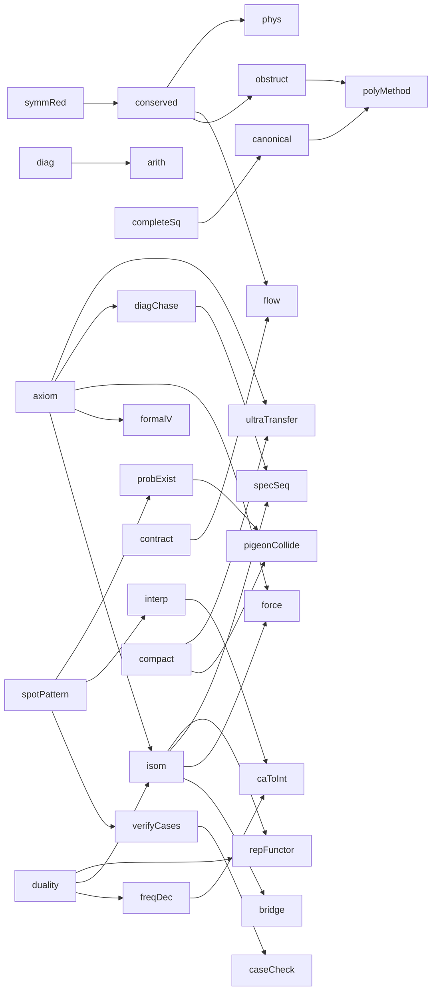

# 10. The Mathematician's Toolbox

## Techniques as functions, organized as a tree

Chapter 9 describes discovery techniques in prose. This chapter re-presents the same 27 techniques as a **structured toolbox** — a catalog you can browse like a standard library's documentation:

- Each technique has a **function signature** with declared inputs, process, outputs, preconditions, and postconditions.
- Techniques are organized as a **tree** (cluster → technique → sub-variant) and a **directed graph** (inheritance edges showing which techniques build on which).
- A **decision flowchart** at the end helps pick the right technique for a new problem.

Read this chapter as a reference, not linearly.

---

## 1. The tree of discovery

All 27 techniques grouped under the 10 clusters. Each leaf is a callable tool.

```mermaid
flowchart TB
  ROOT((Mathematical<br/>Discovery))

  ROOT --> C1[Cluster 1<br/>Experimental &<br/>Numerical]
  ROOT --> C2[Cluster 2<br/>Algebraic<br/>Manipulation]
  ROOT --> C3[Cluster 3<br/>Symmetry &<br/>Invariants]
  ROOT --> C4[Cluster 4<br/>Approximation<br/>& Limits]
  ROOT --> C5[Cluster 5<br/>Abstraction &<br/>Axiomatization]
  ROOT --> C6[Cluster 6<br/>Topology &<br/>Obstruction]
  ROOT --> C7[Cluster 7<br/>Self-Reference<br/>& Impossibility]
  ROOT --> C8[Cluster 8<br/>Iteration &<br/>Fixed Points]
  ROOT --> C9[Cluster 9<br/>Cross-Field<br/>Transfer]
  ROOT --> C10[Cluster 10<br/>Computer &<br/>Collaboration]

  C1 --> spotPattern[spotPatternInTable]
  C1 --> verifyCases[verifyOnSpecialCases]

  C2 --> completeSq[completeTheSquare]
  C2 --> canonical[reduceToCanonicalForm]
  C2 --> compose[composeWithIdentity]

  C3 --> symmRed[symmetryReduction]
  C3 --> conserved[conservedQuantity]
  C3 --> duality[duality]

  C4 --> exhaust[exhaustionSqueeze]
  C4 --> interp[interpolateAndContinue]
  C4 --> freqDec[frequencyDecomposition]

  C5 --> axiom[axiomatizeFromInstances]
  C5 --> isom[structuralIsomorphism]

  C6 --> raiseDim[raiseDimension]
  C6 --> obstruct[obstructionClass]
  C6 --> compact[compactnessArgument]

  C7 --> diag[diagonalize]
  C7 --> arith[arithmetizeSyntax]
  C7 --> force[forceIndependence]

  C8 --> contract[contractionFixedPoint]
  C8 --> descent[infiniteDescent]
  C8 --> flow[flowWithSurgery]

  C9 --> phys[physicsToPDE]
  C9 --> caToInt[complexAnalysisToIntegers]
  C9 --> bridge[analysisAlgebraTopologyBridge]

  C10 --> caseCheck[finiteCaseCheck]
  C10 --> formalV[formalVerify]
  C10 --> distrib[distributedCollaboration]

  ROOT --> C11[Cluster 11<br/>Probabilistic &<br/>Counting]
  ROOT --> C12[Cluster 12<br/>Homological &<br/>Categorical]

  C5 --> ultraTransfer[ultraproductTransfer]

  C11 --> probExist[probabilisticExistence]
  C11 --> pigeonCollide[pigeonholeCollision]
  C11 --> polyMethod[polynomialMethod]

  C12 --> specSeq[spectralSequenceCompute]
  C12 --> diagChase[diagramChase]
  C12 --> repFunctor[representableFunctorTrick]
```



---

## 2. Function dictionary

Every technique is listed below with a uniform schema:

```
name(inputs) → outputs
  category:  which cluster
  preconds:  what must be true to apply
  process:   ordered steps
  postconds: what is produced / guaranteed
  inherits:  other techniques this depends on
  examples:  historical theorems that used it
```

---

### Cluster 1 — Experimental & Numerical

#### `spotPatternInTable(data) → conjecture`
- **category:** Cluster 1 · experimental
- **preconds:** you can enumerate or compute enough examples to form a table
- **process:**
  1. Compute `f(n)` or measure `P(instance)` for as many inputs as feasible.
  2. Stare at the table; compute ratios, differences, logs, second differences.
  3. Guess a closed form or asymptotic; round to nearby known constants.
  4. Verify the guess on inputs not used to derive it.
- **postconds:** a named conjecture `C` with concrete numerical agreement to *k* decimals.
- **inherits:** — (foundational)
- **examples:** Aryabhata's sine table via second-difference recurrence (Ch. 1); Gauss's π(x) ≈ x/ln(x) from prime tables (Ch. 4); Euler's Basel sum 1.6449… → π²/6 (Ch. 3); Gauss's quadratic reciprocity (Ch. 3); Kepler's T² ∝ a³ from Tycho's data (Ch. 2); Jia Xian / Yang Hui binomial triangle (c. 1050 / 1261, MacTutor *Yang Hui*) — tabulating binomial coefficients reveals C(n,k) = C(n−1,k−1) + C(n−1,k); Virahaṅka–Hemachandra sequence (c. 600, Virahaṅka) — mātrā-meter counts reveal M(n) = M(n−1) + M(n−2), earliest documented linear recurrence (Singh, *Historia Mathematica* 1985); Euler's pentagonal number theorem (1741 discovered, 1750 proved) — pentagonal-exponent pattern in ∏(1 − xⁿ) spotted after tabulating ~300 cases (Bell, *Arch. Hist. Exact Sci.* 2010).

#### `verifyOnSpecialCases(conjecture) → refinedConjecture | counterexample`
- **category:** Cluster 1 · experimental
- **preconds:** a conjecture `C` you can test on small / extremal / symmetric instances.
- **process:**
  1. Enumerate special cases: small n, symmetric n, extreme parameters.
  2. For each, test `C`; if it fails, try to modify `C` to accommodate.
  3. Attempt proof on the easiest special case; the proof technique may generalize.
- **postconds:** either refined `C'` with proof of special cases or a counterexample.
- **inherits:** `spotPatternInTable`
- **examples:** FLT for n = 4 (Fermat) → n = 3 (Euler) → n = 5, 7 → Kummer's regular primes → eventual Wiles (Chs. 2, 6); Kepler conjecture — local 2D case by Thue before Hales's 3D (Ch. 6); Goldbach numerical verification to 10³⁰ before Helfgott (Ch. 6).

---

### Cluster 2 — Algebraic Manipulation

#### `completeTheSquare(equation, auxiliary) → solvedEquation`
- **category:** Cluster 2 · algebra
- **preconds:** equation with a quadratic-like imbalance; access to field operations and square roots.
- **process:**
  1. Identify the "almost-square" term and the imbalance.
  2. Add (to both sides) a term that makes the LHS a perfect square.
  3. Take square roots; solve the resulting linear equation.
  4. Generalization: if one auxiliary doesn't suffice (cubic, quartic), introduce a parameter and choose it to force a perfect square on both sides.
- **postconds:** explicit closed-form solution via radicals.
- **inherits:** —
- **examples:** Al-Khwārizmī's quadratic classification (Ch. 1); Cardano's depressed cubic, substitution t = u+v with uv = −p/3 (Ch. 2); Ferrari's quartic via resolvent cubic (Ch. 2); Lagrange's mean value theorem — modify f to match endpoints, apply Rolle (Ch. 3).

#### `reduceToCanonicalForm(object, equivalence) → canonicalRep`
- **category:** Cluster 2 · algebra
- **preconds:** an equivalence relation preserving the property you care about.
- **process:**
  1. Apply changes of basis / substitutions to simplify `object`.
  2. Reach a normal form with the fewest free parameters.
  3. Prove the theorem for the normal form.
  4. Translate the result back via the inverse change of basis.
- **postconds:** theorem on `object` via normal-form representative.
- **inherits:** `completeTheSquare` (special case)
- **examples:** Jordan normal form over ℂ (Ch. 7 catalog); Sylvester's law of inertia for real quadratic forms (Ch. 7 catalog); Hahn–Banach extension within a sublinear-bounded interval (Ch. 5); depressed cubic / quartic (Ch. 2); Li Ye's *tian yuan shu* (1248) — every geometric problem in *Cèyuán Hǎijìng* reduced to a polynomial in a "celestial element" via canonical counting-rod layout; Stevin's decimal-fraction representation (1585, MacTutor *Stevin*) — every real rendered as an infinite decimal; AKS primality test (Agrawal–Kayal–Saxena 2004, *Ann. Math.* 160) — reduces primality to identity testing in ℤ_n[x]/(x^r − 1); Hörmander symbol calculus (1965) — symbol a(x, ξ) as canonical form for a pseudo-differential operator; composition and adjoint become asymptotic expansions.

#### `composeWithIdentity(elements, identity) → newElement`
- **category:** Cluster 2 · algebra
- **preconds:** an algebraic identity showing property P is closed under a binary operation.
- **process:**
  1. Verify the identity on one or two levels.
  2. Given two instances of P, combine them via the identity.
  3. Iterate — build a semigroup/monoid of P-instances.
  4. Reduce a general case to a base case via composition.
- **postconds:** general P-statement proved by reducing to primes or generators.
- **inherits:** —
- **examples:** Diophantus–Brahmagupta two-square identity (Ch. 2); Brahmagupta's *bhāvanā* and Bhāskara's *chakravāla* (Ch. 1); Euler's four-square identity used in Lagrange's proof (Ch. 3); Euler product ∏(1 − p⁻ˢ)⁻¹ = Σ 1/nˢ (Ch. 3); Thābit ibn Qurra's amicable-number rule (9th c., Hogendijk, *Historia Math.* 1985) — parameterized identity M = 2ⁿ·p·q, N = 2ⁿ·r from a prime triple (p, q, r); first nontrivial amicable-pair algorithm; Virahaṅka–Hemachandra recurrence (c. 600) — 2-term additive composition M(n) = M(n−1) + M(n−2) from syllable-length decomposition; Narayana Pandita's cow sequence (1356, MathWorld *NarayanaCowSequence*) — 3-term composition aₙ = aₙ₋₁ + aₙ₋₃ with characteristic root the supergolden ratio; Viète's infinite product for π (1593) — half-angle identity 2cos²(θ/2) = 1 + cos θ iterated ad infinitum; Euler's pentagonal number theorem (1741/1750) — Franklin's 1881 sign-reversing involution gives the combinatorial composition rule on distinct-part partitions; Jacobi triple product identity (1829, Andrews *Theory of Partitions* 1984) — composes Euler products with theta-style sums, unifying q-series and modular forms.

---

### Cluster 3 — Symmetry & Invariants

#### `symmetryReduction(configuration, group G) → orbitRepresentative`
- **category:** Cluster 3 · symmetry
- **preconds:** a group `G` acts on your configuration; the property you want is `G`-invariant.
- **process:**
  1. Identify the symmetry group `G`.
  2. Pass to orbit representatives `config / G`.
  3. Prove the theorem on representatives.
  4. Lift back to arbitrary configurations via `G`.
- **postconds:** theorem on all `G`-equivalent configurations.
- **inherits:** —
- **examples:** Thales via isosceles-twice (Ch. 1); Archimedes' sphere via rotational slices (Ch. 1); Brahmagupta's orthodiagonal quadrilateral (Ch. 1); Noether's theorem — Lie-group action on action integral (Ch. 5).

#### `conservedQuantity(system, transformation) → invariantI`
- **category:** Cluster 3 · symmetry
- **preconds:** an object or process with allowed transformations.
- **process:**
  1. Find a quantity `I` that is unchanged under the transformation.
  2. Prove invariance by checking on generators.
  3. Objects with distinct `I` cannot be equivalent; sum of local `I`s = global constant.
- **postconds:** classification or constraint by `I`.
- **inherits:** `symmetryReduction`
- **examples:** Euler's V − E + F = 2 (Ch. 3); Descartes' angular defect summing to 4π (Ch. 2); Gauss's Theorema Egregium — K is intrinsic (Ch. 4); Noether currents — energy, momentum, charge (Ch. 5); Gauss–Bonnet ∫K dA = 2π·χ (Ch. 4); Atiyah–Singer index = topological index (Ch. 6).

#### `duality(category C, category D) → equivalenceCD`
- **category:** Cluster 3 · symmetry
- **preconds:** two theories with a contravariant structure-preserving correspondence.
- **process:**
  1. Establish the correspondence on objects and morphisms.
  2. Verify it reverses arrows and preserves composition.
  3. Translate a problem from `C` to `D`; solve there; translate back.
- **postconds:** a theorem in one theory yields a theorem in the dual theory.
- **inherits:** —
- **examples:** Menelaus ↔ Ceva (Chs. 1, 7); Desargues ↔ Pascal (Ch. 2); Galois correspondence (Ch. 4); Stone duality (Ch. 5); Gelfand–Naimark (Ch. 7); Poincaré duality Hᵏ ↔ H_{n−k} (Ch. 7); Fourier transform pair; Legendre transform (1787, EoM *Legendre transform*) — canonical involution f ↔ f*; points ↔ tangent lines; (f*)* = f; backbone of Hamiltonian mechanics, convex analysis (Fenchel), and thermodynamic potentials.

---

### Cluster 4 — Approximation & Limits

#### `exhaustionSqueeze(target, lower, upper) → exactValue`
- **category:** Cluster 4 · approximation
- **preconds:** you can produce sequences `Lₙ ≤ target ≤ Uₙ` where both `Lₙ`, `Uₙ` converge.
- **process:**
  1. Construct inscribed (lower) and circumscribed (upper) approximants.
  2. Show `Uₙ − Lₙ → 0`.
  3. Conclude `target = lim Lₙ = lim Uₙ`.
  4. Variant: bisection — halve the interval containing the target, iterate.
- **postconds:** exact value or closed form.
- **inherits:** —
- **examples:** Archimedes' circle area and sphere volume via 96-gons (Ch. 1); Bolzano–Weierstrass bisection (Ch. 4); Weierstrass approximation — polynomial squeeze in sup-norm (Ch. 4); Riemann integrability; Liu Hui's polygon π (c. 263 CE, Lam & Ang, *Historia Math.* 1986) — inscribed polygon-doubling on a hexagon base with explicit passage to the limit ("cut again and again until one can cut no more"); Zu Chongzhi's 355/113 (5th c.) — 24 576-gon yielding 3.1415926 < π < 3.1415927, a bound that stood 900 years; al-Kāshī's 16-decimal π (1424, Luckey, *Die Rechenkunst bei al-Kashi* 1951) — 3·2²⁸-gon via iterated square-root extraction in sexagesimal; Nilakantha's arctan-series exhaustion proof (c. 1500, Sarma ed. *Tantrasaṅgraha*) — chord-arc squeeze yielding a power series rather than a single real value; Stevin's bisection-based algorithmic IVT (1585) — digit-by-digit location of polynomial roots via decimal interval halving.

#### `interpolateAndContinue(formulaOnN) → formulaOnC`
- **category:** Cluster 4 · approximation
- **preconds:** a formula known for integer arguments you'd like to extend.
- **process:**
  1. Identify a smooth functional recurrence the integer values satisfy.
  2. Pick an interpolation method (falling factorials, ratios, limits).
  3. Extend to real/complex arguments where it still converges.
  4. If the domain has natural boundaries, analytically continue via functional equation.
- **postconds:** extended formula valid on a larger domain.
- **inherits:** `spotPatternInTable`
- **examples:** Wallis's π/2 product from ∫(1−x²)ⁿ dx at n=1/2 (Ch. 2); Newton's generalized binomial C(r, k) (Ch. 2); Taylor series via derivatives-as-shrunken-differences (Ch. 3); Euler's Γ function; Riemann ζ(s) continued from Re(s) > 1 to all of ℂ \ {1} (Ch. 4); Mādhava's arctangent series (c. 1400, MacTutor *Madhava*) — extending Aryabhata's sine-table construction to a full analytic series for arctan, now called the Mādhava–Gregory–Leibniz series; Tracy–Widom distribution (1993–94, arXiv:hep-th/9211141) — Painlevé II transcendent continued as the edge-scaling limit of GUE top eigenvalue. *Inherited: interpolateAndContinue. Added: integrable-systems τ-function technology.*

#### `frequencyDecomposition(function) → {modes, coefficients}`
- **category:** Cluster 4 · approximation
- **preconds:** a complete orthogonal basis (sinusoids, characters, spherical harmonics).
- **process:**
  1. Project `f` onto each basis element via inner product.
  2. Manipulate mode-by-mode (differentiation and integration decouple).
  3. Reassemble via inverse transform.
- **postconds:** problem reduces to algebra on coefficients.
- **inherits:** `duality` (Fourier pair is a duality)
- **examples:** de Moivre's (cos θ + i sin θ)ⁿ (Ch. 3); Euler's e^(iθ) = cos θ + i sin θ (Ch. 3); Fourier series for heat equation (Ch. 4); Laplace's CLT via characteristic functions (Ch. 3); Plancherel L² isometry (Ch. 7); al-Ṭūsī's couple (c. 1247, Ragep ed. *al-Tadhkira* 1993) — linear translation decomposed into two uniform circular modes z(t) = r e^{iωt} + r e^{−iωt}; earliest non-trivial frequency decomposition outside geometry; Jacobi triple product identity (1829) — theta-style Fourier-like decomposition of an infinite product as a lattice sum; Hörmander pseudo-differential operators (1965) — Fourier-multiplier framework with symbol calculus; unifies elliptic, hypoelliptic, wave-propagation theory; Tracy–Widom Airy-kernel Fredholm determinant (1994) — edge spectrum via orthogonal-polynomial expansion; Borcherds / monstrous moonshine q-expansions (1992) — McKay–Thompson series as Hauptmoduln; q-expansion is the frequency decomposition of a vertex operator algebra character.

---

### Cluster 5 — Abstraction & Axiomatization

#### `axiomatizeFromInstances(instances[]) → axiomSystemA`
- **category:** Cluster 5 · abstraction
- **preconds:** multiple concrete phenomena sharing structural features.
- **process:**
  1. List the shared operations and laws across instances.
  2. State them as bare axioms.
  3. Prove theorems from the axioms alone.
  4. Every instance inherits all theorems for free.
- **postconds:** a general theory; each concrete case becomes a corollary.
- **inherits:** —
- **examples:** Euclid's *Elements* (Ch. 1); al-Khwārizmī's six canonical quadratic types (Ch. 1); Hilbert's basis theorem — abstract Noetherian condition (Ch. 5); Noether's isomorphism theorems (Ch. 5); Banach spaces — complete normed vector space (Ch. 5); Zermelo–Fraenkel set theory (Ch. 5); Jyeshthadeva's *Yuktibhāṣā* (c. 1530, Sarma et al. *Gaṇita-Yukti-Bhāṣā* 2008) — first proof-first mathematics textbook in a South Asian vernacular; axiomatizes Kerala-school series methods from concrete numerical instances; Voiculescu's free probability (1985, arXiv:1908.08125) — axiomatizes non-commutative "free independence" from observed operator behavior in L(F_n).

#### `structuralIsomorphism(theory T1, theory T2) → bridge`
- **category:** Cluster 5 · abstraction
- **preconds:** two unrelated-looking theories with a structural correspondence.
- **process:**
  1. Identify the objects and morphisms in each.
  2. Construct a functor (or equivalence) between them.
  3. Transport a hard theorem in `T1` to an easier problem in `T2`.
- **postconds:** theorems on both sides.
- **inherits:** `duality`, `axiomatizeFromInstances`
- **examples:** Galois correspondence subgroups ↔ subfields (Ch. 4); Stone representation — Boolean algebras ↔ Stone spaces (Ch. 5); Gelfand–Naimark — C*-algebras ↔ LCH spaces (Ch. 7); Taniyama–Shimura–Wiles modularity — elliptic curves ↔ modular forms (Ch. 6); Grothendieck's Spec — rings ↔ affine schemes; Zu Geng principle (5th c., Lam & Shen, *Historia Math.* 1985) — cross-section-area function ↔ volume; equal cross-sections imply equal volumes, 11 centuries before Cavalieri; Gauss's 17-gon constructibility (1796, Savitt, Cornell notes) — abelian-group structure of 17th roots of unity ↔ nested quadratic extensions; cyclic Galois group of order 2⁴ diagonalized by a tower of square roots; Hrushovski's geometric Mordell–Lang (1996, J. AMS 9) — model-theoretic Zariski geometry ↔ algebraic-geometric subvariety structure in positive characteristic; Borcherds' monstrous moonshine (1992, Invent. Math. 109) — Monster Lie algebra ↔ modular-form Hauptmoduln ↔ finite simple group bridge.

#### `ultraproductTransfer(family of L-structures (A_i)_{i∈I}, ultrafilter U on I) → limitStructure`
- **category:** Cluster 5 · abstraction-logic
- **preconds:** a family of structures for a first-order language L; an ultrafilter U on the index set I.
- **process:**
  1. Form the set-theoretic product ∏ A_i and quotient by the U-equivalence: (a_i) ~_U (b_i) iff {i : a_i = b_i} ∈ U.
  2. Interpret L-symbols componentwise, noting that ultrafilter decisions make quotients respect Boolean connectives.
  3. By Łoś's theorem, a first-order sentence φ holds in ∏ A_i/U iff {i : A_i ⊨ φ} ∈ U.
  4. Use the transfer principle to move a sentence true "on U-many factors" into a theorem about the ultraproduct, and back (when U is principal or the theorem is first-order absolute).
- **postconds:** a limit structure in which first-order truth is preserved from U-large subsets of the family.
- **inherits:** `axiomatizeFromInstances`, `compactnessArgument`
- **examples:** Łoś's theorem (1955, Jerzy Łoś) — the fundamental transfer principle; (nLab *Los theorem*). Robinson's nonstandard analysis and hyperreals *ℝ (1960/66, Abraham Robinson) — ℝ^ℕ/U gives infinitesimals and infinite elements with first-order transfer. Compactness theorem in first-order logic — one-line corollary via ultraproducts of finite-satisfaction families. Ax–Kochen theorem on p-adic fields (1965) — ultraproduct of ℚ_p across p matches ultraproduct of 𝔽_p((t)). Hrushovski's geometric Mordell–Lang (1996) — model-theoretic Zariski geometries applied to function-field arithmetic.

---

### Cluster 6 — Topology & Obstruction

#### `raiseDimension(problem, +k dims) → problemInHigherSpace`
- **category:** Cluster 6 · topology
- **preconds:** a problem resistant in dimension `n` but tractable when embedded higher.
- **process:**
  1. Embed or extend the problem into dim `n + k` with added structure.
  2. Solve in the higher-dimensional ambient.
  3. Project or restrict the solution back to dim `n`.
- **postconds:** theorem in original dimension, proved via detour.
- **inherits:** —
- **examples:** Desargues 2D theorem proved in 3D (Ch. 2); Gauss's FTA via two real curves in ℝ² crossing (Ch. 3); Faltings — curves via their Jacobian abelian varieties (Ch. 6); Wiles — elliptic curve via its Galois representation (Ch. 6); Perelman — 3-manifolds deformed in infinite-dim metric space (Ch. 6).

#### `obstructionClass(target, invariant) → possibilityOrForbidden`
- **category:** Cluster 6 · topology
- **preconds:** a topological/algebraic invariant that must vanish for the construction to exist.
- **process:**
  1. Define the invariant (degree, characteristic class, Galois group, minor).
  2. Compute it; if nonzero, the construction is impossible.
  3. Often the *impossibility* is the theorem.
- **postconds:** either a construction or a provable obstruction.
- **inherits:** `conservedQuantity`
- **examples:** Brouwer no-retraction — degree(identity S^n) ≠ 0 (Ch. 5); hairy-ball theorem χ(S²) = 2 (Ch. 7); Abel–Ruffini — A₅ non-solvable blocks radical formulas (Ch. 4); Wagner/Robertson–Seymour forbidden minors (Ch. 6); Liouville's transcendentals (1844, Chanillo, Rutgers notes) — being algebraic of degree d forces |α − p/q| ≥ c/q^d; any number exceeding the bound is obstructed from being algebraic; Seiberg–Witten invariants (1994, arXiv:hep-th/9411102) — SW(X, s) distinguishes smooth structures on 4-manifolds; nonzero SW obstructs certain metric/topological properties (e.g., Einstein metrics per LeBrun).

#### `compactnessArgument(space) → convergentLimit`
- **category:** Cluster 6 · topology
- **preconds:** a topological space with some form of compactness.
- **process:**
  1. Take a sequence / net / ultrafilter in the space.
  2. Extract a convergent subsequence / accumulation point.
  3. Show the limit has the desired property (closed conditions pass to limits).
- **postconds:** existence of an extremal / limit object.
- **inherits:** —
- **examples:** Bolzano–Weierstrass (Ch. 4); Heine–Borel (Ch. 7); Tychonoff (Ch. 5); Banach–Alaoglu (Ch. 7); Montel's theorem underlying Riemann mapping (Ch. 4); compactness theorem in first-order logic (Ch. 7).

---

### Cluster 7 — Self-Reference & Impossibility

#### `diagonalize(enumerationOfF) → newElement ∉ enumeration`
- **category:** Cluster 7 · self-reference
- **preconds:** an alleged enumeration `f₁, f₂, …` of all objects of type T.
- **process:**
  1. For each `fₙ`, identify its "n-th component."
  2. Construct a new object `g` differing from `fₙ` at component `n`, for every `n`.
  3. `g` is of type T but not in the enumeration — contradiction.
- **postconds:** non-enumerability, uncomputability, or undecidability.
- **inherits:** —
- **examples:** Cantor's uncountability of ℝ (Ch. 4); Gödel's G = "this sentence is unprovable" (Ch. 5); Turing's halting theorem — `D(⟨D⟩)` contradicts itself (Ch. 5); Rice's theorem (Ch. 7); Cantor–Bernstein–Schröder-adjacent constructions.

#### `arithmetizeSyntax(formalSystem) → encodingPhi`
- **category:** Cluster 7 · self-reference
- **preconds:** a formal system capable of primitive recursion.
- **process:**
  1. Assign each symbol a number; encode formulas and proofs via prime factorization.
  2. Express syntactic predicates (`isProof(p, s)`) as arithmetic predicates.
  3. Use a fixed-point / substitution lemma to build self-referential sentences.
- **postconds:** syntax becomes an object of arithmetic; self-reference is formal.
- **inherits:** `diagonalize`
- **examples:** Gödel numbering (Ch. 5); universal Turing machine — machines as data on tape (Ch. 5); Matiyasevich/MRDP — c.e. sets are Diophantine (Ch. 7); Cook–Levin — NP computations as SAT (Ch. 7); Piṅgala's binary metrical representation (c. 3rd–2nd century BCE, Cuemath; Hayashi in *Studies in History of Indian Mathematics* 2010) — encodes Sanskrit prosodic L/G strings as binary numbers via a two-way algorithm; Gödel-numbering ~2100 years early; IP = PSPACE / sumcheck protocol (Shamir 1992, J. ACM 39) — replaces quantified Boolean formulas by polynomial identities over a large field, verified by interactive sumcheck; PCP theorem (Arora–Safra 1992 + Arora–Lund–Motwani–Sudan–Szegedy 1998, J. ACM 45) — proofs arithmetized as polynomial objects tested probabilistically with O(log n) randomness and O(1) queries.

#### `forceIndependence(theory T, statement S) → modelsProAndCon`
- **category:** Cluster 7 · self-reference
- **preconds:** a consistent formal theory; a statement you suspect it cannot decide.
- **process:**
  1. Build an inner model (Gödel-style L) where `S` holds.
  2. Build an extension (Cohen-style forcing) where `¬S` holds.
  3. Both being models of `T` shows `S` is independent of `T`.
- **postconds:** `S ⊥ T` — proved unprovable in either direction.
- **inherits:** `axiomatizeFromInstances`, `structuralIsomorphism`
- **examples:** Gödel's constructible universe L — Con(ZF) ⇒ Con(ZFC + GCH) (Ch. 5); Cohen's forcing — Con(ZF) ⇒ Con(ZF + ¬CH) (Ch. 6); Solovay's model of ZF + "every set is measurable" (Ch. 7).

---

### Cluster 8 — Iteration & Fixed Points

#### `contractionFixedPoint(T on complete space X) → uniqueFixedPoint`
- **category:** Cluster 8 · iteration
- **preconds:** complete metric space; self-map that strictly shrinks distances (`d(Tx, Ty) ≤ k·d(x,y)` with `k < 1`).
- **process:**
  1. Start with any `x₀`.
  2. Iterate `xₙ₊₁ = T(xₙ)`.
  3. Sequence is Cauchy; converges by completeness.
  4. Limit is the unique fixed point.
- **postconds:** existence + uniqueness + constructive approximation.
- **inherits:** —
- **examples:** Banach fixed-point theorem (Ch. 5); Picard–Lindelöf existence for ODEs (Ch. 7); Newton's method (classical); implicit function theorem; Nash equilibrium via Kakutani (Ch. 7); Yau's solution of the Calabi conjecture (1976, Shing-Tung Yau, CPAM 31) — continuity method on the complex Monge–Ampère equation as a parameter-family of fixed-point problems; openness via implicit function theorem, closedness via C⁰/C²/C³ a priori estimates. *Inherited: contractionFixedPoint. Added: a priori estimates via De Giorgi–Nash–Moser iteration.* Qin Jiushao's digit-by-digit root-finding (1247, Libbrecht, MIT Press 1973) — iterated polynomial deflation P(c+y) at each digit is a contraction in the base-10 ultrametric; 550 years before Ruffini and Horner, contemporaneous with Sharaf al-Dīn al-Ṭūsī's Persian version (Ruffini–Horner–Qin–al-Ṭūsī scheme).

#### `infiniteDescent(claim) → contradiction`
- **category:** Cluster 8 · iteration
- **preconds:** a property with a natural integer measure; a mechanism to reduce.
- **process:**
  1. Assume a counterexample exists; pick one with *minimal* measure.
  2. Construct a strictly smaller counterexample from it.
  3. Contradicts minimality — hence no counterexample exists.
- **postconds:** negative existence statement.
- **inherits:** —
- **examples:** Euclid's infinitude of primes — extend any finite list (Ch. 1); Fermat's two-square theorem — descent on `m·p = a² + b² + 1² + 0²` (Ch. 2); Fermat's FLT for n = 4 on `x⁴ + y⁴ = z²` (Ch. 2); Bhāskara's *chakravāla* — monotone decrease of `|k|` (Ch. 1); Lagrange's four-square theorem (Ch. 3); Kummer's ideal-theoretic descent.

#### `flowWithSurgery(initial, flowEquation) → longTimeStructure`
- **category:** Cluster 8 · iteration
- **preconds:** a parabolic PDE or evolution equation on your object.
- **process:**
  1. Evolve the object by the flow `∂/∂t` equation.
  2. When singularities form at finite time, classify them.
  3. Cut out singular regions; reglue; continue the flow.
  4. Monitor a monotone quantity (entropy, reduced volume) to control singularities.
- **postconds:** long-time-limit classification or decomposition.
- **inherits:** `contractionFixedPoint`, `conservedQuantity` (monotone monitor)
- **examples:** Perelman's Ricci flow with surgery proving Poincaré + geometrization (Ch. 6); Weierstrass approximation by Gaussian convolution (heat flow smoothing) (Ch. 4); Bernstein polynomials via the law of large numbers (Ch. 4); Hironaka's resolution of singularities (1964, Fields Medal 1970, Hauser, *Bull. AMS* 2003) — blow up centers where the "Hironaka character" is maximized; invariant strictly decreases under admissible blowups; terminates with a smooth model, analogous to Ricci-flow entropy monotone monitor.

---

### Cluster 9 — Cross-Field Transfer

#### `physicsToPDE(phenomenon) → mathematicalFramework`
- **category:** Cluster 9 · transfer
- **preconds:** a physical phenomenon with modellable dynamics.
- **process:**
  1. Identify conserved quantities, boundary conditions, and governing equations.
  2. Formulate a PDE or variational principle.
  3. The PDE outlives the physics — it applies in pure mathematics.
- **postconds:** a technique transferable to problems with no physical origin.
- **inherits:** `conservedQuantity`
- **examples:** Fourier's heat equation → Fourier series (Ch. 4); Gauss's Hanover survey → intrinsic curvature (Ch. 4); Green's electromagnetism → vector-calculus identity (Ch. 4); Noether's GR problem → symmetry-conservation correspondence (Ch. 5); Torricelli fluid efflux → Bernoulli's principle (Ch. 2); Brownian motion → martingale / Black–Scholes; Seiberg–Witten equations (1994, arXiv:hep-th/9411102) — N = 2 super Yang–Mills duality in physics distilled by Witten into U(1)-connection + spinor equations F_A⁺ = σ(Φ), D_A Φ = 0; Itô's formula (1944, Kiyosi Itô, *Proc. Imp. Acad. Tokyo* 20) — Brownian-motion physics distilled into stochastic integral + second-order "Itô correction" chain rule; foundation of stochastic PDE and mathematical finance.

#### `complexAnalysisToIntegers(arithmeticFunction Q) → asymptoticForQ`
- **category:** Cluster 9 · transfer
- **preconds:** an arithmetic function `Q(n)` you want to understand in aggregate.
- **process:**
  1. Encode as a Dirichlet series `Σ Q(n)/nˢ` or generating function.
  2. Extend by analytic continuation to a meromorphic function on ℂ.
  3. Locate poles and zeros; use Perron's formula or contour integration.
  4. Shift the contour; residues become the asymptotic.
- **postconds:** asymptotic for partial sums of `Q`.
- **inherits:** `interpolateAndContinue`, `frequencyDecomposition`
- **examples:** Dirichlet's primes in APs via L-functions (Ch. 7); Riemann's 1859 memoir (Ch. 4); Prime Number Theorem — zeta non-vanishing on Re(s) = 1 (Ch. 4); Helfgott's weak Goldbach via circle method (Ch. 6); Hardy–Ramanujan partition formula (1918, *Proc. LMS*) — canonical modern instance; generating function ∏(1 − qⁿ)⁻¹, contour over |q| = r < 1, major/minor arcs, modular transformation on the dominant arc; launched the circle method; Deligne's Weil Riemann hypothesis (1974, Publ. IHES 43) — averages L-functions on a Lefschetz pencil; weight filtration on étale cohomology controls archimedean bounds of Frobenius eigenvalues. *Inherited: complexAnalysisToIntegers. Added: étale-cohomology bridge.*

#### `analysisAlgebraTopologyBridge(problem in one field) → reformulationInAnother`
- **category:** Cluster 9 · transfer
- **preconds:** a problem stuck in one field; another field has a functorial view.
- **process:**
  1. Translate via a categorical or geometric correspondence.
  2. Solve in the new field, where structure is richer.
  3. Translate answer back.
- **postconds:** theorem in the original field via the translation.
- **inherits:** `structuralIsomorphism`
- **examples:** Atiyah–Singer — analytic index = topological index (Ch. 6); Riemann–Roch — sheaf cohomology = Euler characteristic (Ch. 4); Faltings's Mordell — heights + Galois reps (Ch. 6); Wiles's FLT — Frey curve + level-lowering + R=T (Ch. 6); Green–Tao transference — Szemerédi + sieve (Ch. 6); Deligne's Weil Riemann hypothesis (1974, Publ. IHES 43) — étale-cohomology bridge transfers analytic archimedean bounds into arithmetic weight statements about Frobenius eigenvalues (also engages `complexAnalysisToIntegers`).

---

### Cluster 10 — Computer-Assisted & Collaborative

#### `finiteCaseCheck(problem, reducibility) → machineVerifiedProof`
- **category:** Cluster 10 · delegation
- **preconds:** a theoretical reduction of your problem to a finite (possibly huge) list of cases.
- **process:**
  1. Prove: if each of cases `C₁, …, Cₙ` satisfies property P, the full theorem holds.
  2. Code and machine-check each `Cᵢ`.
  3. Aggregate certificates.
- **postconds:** theorem proved pending trust in the machine check.
- **inherits:** `verifyOnSpecialCases` (generalized to finite-but-enormous)
- **examples:** Four Color Theorem — ~1,500 reducible configurations (Ch. 6); Kepler conjecture — ~100,000 nonlinear programs (Ch. 6); Robertson–Seymour consequence — cubic-time decidability of minor-closed properties (Ch. 6); PCP theorem (Arora–Safra 1992 + ALMSS 1998) — verifier reads O(log n) random bits and queries O(1) bits of the proof; a constant-query verification is a finite spot-check of an arithmetized proof.

#### `formalVerify(proofInProverLanguage) → machineCheckedCertificate`
- **category:** Cluster 10 · delegation
- **preconds:** a prose proof and a theorem-prover (Coq, Lean, Isabelle/HOL).
- **process:**
  1. Encode definitions and statements in the prover's logic.
  2. Translate each inferential step into formal tactics.
  3. The prover kernel checks every rule.
- **postconds:** certainty at the level of the kernel; independent of human review.
- **inherits:** `axiomatizeFromInstances`
- **examples:** Flyspeck — Kepler conjecture in HOL Light / Isabelle (Ch. 6); Gonthier's Coq Four Color Theorem (Ch. 6); Gonthier's Feit–Thompson odd-order theorem in Coq (Ch. 6); Lean mathlib at 200k+ theorems.

#### `distributedCollaboration(bigProblem, splitStrategy) → aggregateProof`
- **category:** Cluster 10 · delegation
- **preconds:** a problem decomposable into sub-tasks suitable for different specialists.
- **process:**
  1. Publish a roadmap or subproblem list.
  2. Distribute parts across a community.
  3. Maintain shared notation, lemmas, and version control.
  4. Aggregate via referees or an editor.
- **postconds:** theorem with attribution across many authors.
- **inherits:** —
- **examples:** Classification of Finite Simple Groups (~100 authors, ~10k pages) (Ch. 6); Modularity Theorem full case (Wiles → Diamond → CDT → BCDT) (Ch. 6); Polymath 8 reducing Zhang's bound to 246 (Ch. 6).

---

### Cluster 11 — Probabilistic & Counting Arguments

*Unifying idea:* establish existence by counting volume or positive probability rather than explicit construction.

#### `probabilisticExistence(event space Ω, distribution μ, target property P) → objectWithPositiveProbability`
- **category:** Cluster 11 · probabilistic
- **preconds:** a set of candidate objects you cannot easily construct directly; a probability distribution over candidates; quantifiable "bad events" whose avoidance encodes P.
- **process:**
  1. Define a distribution μ over candidate objects.
  2. Compute or bound the expected count of P-violations (union bound, first-moment method).
  3. If E[violations] < 1 (or Pr(all good) > 0), some realization achieves P.
  4. Variants: Lovász local lemma when violations are only locally correlated via a dependency graph; dependent random choice when you select on common neighborhoods.
- **postconds:** existence of an object with property P, with no construction.
- **inherits:** —
- **examples:** Erdős's Ramsey lower bound R(k,k) ≥ 2^{k/2} (1947, Erdős) — random 2-coloring of K_N, expected monochromatic K_k count < 1; (Alon, *Notices AMS*). Shannon's noisy-channel coding theorem (1948) — random codebook, expected decoding error → 0. Lovász Local Lemma (1975, Erdős–Lovász) — local-dependence variant with dependency graph; Moser–Tardos (2010) made it constructive; (Alon & Spencer, *The Probabilistic Method*). Dependent random choice (Fox–Sudakov 2011) — conditional sampling on common neighborhoods; (arXiv:0909.3271). Marcus–Spielman–Srivastava / Kadison–Singer (2015) — interlacing polynomial families as a real-stability refinement; (arXiv:1306.3969). Szemerédi regularity lemma (1975/78) — energy-increment partition as a derandomization analog; (Szemerédi, *Colloques Int. CNRS* 260).

#### `pigeonholeCollision(objects, bins with |objects| > |bins|) → twoInSameBin`
- **category:** Cluster 11 · counting
- **preconds:** a finite (or measurably finite) collection of objects and a partition into strictly fewer bins; some map objects → bins.
- **process:**
  1. Identify objects and bins; verify |objects| > |bins|.
  2. By counting alone, at least two objects land in the same bin.
  3. Extract and use the colliding pair; often the difference or ratio of two colliding objects is the sought-for witness.
- **postconds:** existence of a collision — a nontrivial near-equality, a cycle, a repeated configuration.
- **inherits:** — (foundational; discrete analog of `compactnessArgument`)
- **examples:** Dirichlet's approximation theorem (1842, Dirichlet) — Q+1 fractional parts {kα} in Q bins of length 1/Q force |{iα} − {jα}| < 1/Q, hence |α − p/q| < 1/(qQ); (Rittaud & Heeffer, *Math. Intelligencer* 36). Ramsey's theorem base case — any 2-coloring of K_6 has a monochromatic triangle by pigeonholing 5 edges at a vertex into 2 colors. Erdős–Ko–Rado (1961) — pigeonholing intersecting families of k-subsets. Dirichlet's theorem on primes in arithmetic progressions (1837, Schubfachprinzip application). *Inherited: —. Added: discrete existence without topology.*

#### `polynomialMethod(combinatorial or circuit target, ambient field 𝔽) → dimensionOrDegreeBound`
- **category:** Cluster 11 · algebra-meets-counting
- **preconds:** a target set or function over a field 𝔽; a meaningful notion of "low-degree" polynomial vanishing or approximating on the target.
- **process:**
  1. Count: exhibit a nonzero low-degree polynomial P that vanishes on the target (by dimension-counting: if target is smaller than the space of degree-≤d polynomials, pigeonhole gives one).
  2. Exploit structure: P restricted to a structured subfamily (a line, a subspace, an affine subspace) is univariate and has too many zeros, forcing a contradiction or a size bound.
  3. Alternatively: approximate a target function by low-degree polynomials (Razborov–Smolensky); then a function resisting low-degree approximation cannot be computed by small low-depth circuits.
- **postconds:** a combinatorial size bound, a circuit lower bound, or a structural decomposition.
- **inherits:** `reduceToCanonicalForm`, `obstructionClass`
- **examples:** Razborov–Smolensky AC⁰[p] lower bounds (1987, Razborov and Smolensky independently) — low-degree polynomial approximators over 𝔽_p; MOD_q resists approximation by degree (log s)^d; (Smolensky, STOC 1987). Dvir's finite-field Kakeya theorem (2009, Dvir) — if |K| < C(n+q−1, n), some low-degree P vanishes on K, but then vanishes on a line in every direction, contradicting ≠ 0; (J. AMS 22). Guth–Katz distinct distances (2010) — polynomial partitioning in ℝ². Croot–Lev–Pach / Ellenberg–Gijswijt cap-set bound (2016) — low-degree polynomial method over 𝔽_3ⁿ.

---

### Cluster 12 — Homological / Categorical Methods

*Unifying idea:* transfer structural information across categories via functors, exact sequences, and spectral sequences computing derived invariants.

#### `spectralSequenceCompute(filteredComplex) → gradedInvariant`
- **category:** Cluster 12 · homological
- **preconds:** a filtered chain/cochain complex, a double complex, or a fibration; an abelian (or triangulated) category of coefficients.
- **process:**
  1. Choose a filtration of the complex compatible with differentials.
  2. Form the E₁-page from associated graded pieces; compute iterated cohomology page-by-page.
  3. Identify when the spectral sequence collapses or degenerates at a known page; read off the graded pieces of the target cohomology.
  4. Assemble extensions to recover the target up to isomorphism of filtered groups.
- **postconds:** the target invariant computed up to filtration, often sharply.
- **inherits:** `diagramChase`, `structuralIsomorphism`
- **examples:** Leray spectral sequence (1946, Leray) — E₂^{p,q} = H^p(Y; R^q f_* F) ⟹ H^{p+q}(X; F) for a map f: X → Y; invented with sheaf theory in a POW camp. (nLab *spectral sequence*). Serre spectral sequence (1951) — fibration version; computed homotopy groups of spheres. Grothendieck spectral sequence (1957) — composition of derived functors. Atiyah–Hirzebruch spectral sequence — generalized cohomology from ordinary cohomology. Eilenberg–Moore spectral sequence.

#### `diagramChase(commutative diagram with exact rows) → connectingMap | induction`
- **category:** Cluster 12 · homological
- **preconds:** a commutative diagram in an abelian category with exact rows (or columns); selected hypotheses on some vertical maps (mono, epi, iso).
- **process:**
  1. Pick an element in a specified kernel/cokernel position.
  2. Lift through exactness along a row; apply a vertical map; project via exactness of the next row.
  3. Verify that the construction is well-defined (independent of choices) by re-chasing.
  4. Package the result as a canonical morphism (connecting homomorphism) or a direct conclusion (isomorphism of a middle vertical).
- **postconds:** a long exact sequence, a connecting homomorphism, or a verified universal property.
- **inherits:** `axiomatizeFromInstances`
- **examples:** Snake lemma (Cartan–Eilenberg 1956 systematized) — kernels → cokernels exact sequence with connecting ∂; (nLab *snake lemma*). Five lemma (folklore, Cartan–Eilenberg 1956) — middle vertical iso from outer-four hypotheses. Long exact sequence of a pair (Eilenberg–Steenrod axioms) — homology of (X, A) from H_*(A) → H_*(X). Mayer–Vietoris sequence — homology of X = U ∪ V from U, V, U ∩ V. Nine lemma.

#### `representableFunctorTrick(object X in locally small category C) → universalPropertyOrNatTrans`
- **category:** Cluster 12 · categorical
- **preconds:** a locally small category C; an object X ∈ C (or a functor X: C^op → Set); interest in morphisms into X or in structural characterization of X.
- **process:**
  1. Replace X by its presheaf Hom(−, X): C^op → Set (Yoneda embedding).
  2. Any natural transformation Hom(−, X) ⟹ F is determined by its value on id_X, yielding bijection Nat(Hom(−, X), F) ≅ F(X).
  3. Translate construction/characterization problems about X into problems about Hom(−, X); use universal properties (limits, adjoints) in the functor category.
  4. Transport the solution back to X via the bijection.
- **postconds:** characterization of X up to isomorphism via its represented functor; construction of canonical morphisms by building natural transformations.
- **inherits:** `duality`, `structuralIsomorphism`
- **examples:** Yoneda lemma (Yoneda 1954, oral communication at Gare du Nord; popularized by Mac Lane 1971) — the archetypal result; Nat(Hom(−, c), X) ≅ X(c). (nLab *Yoneda lemma*). Freyd's adjoint functor theorem (1964, Freyd) — left adjoint of a limit-preserving R: C → D exists given the solution-set condition; (Freyd, *Abelian Categories*). Tannaka–Krein reconstruction — a group recovered from its category of representations. Isbell duality — adjunction between presheaves and co-presheaves.

---

## 3. Inheritance graph

Edges point *from* a base technique *to* a technique that builds on it. Use this to see which techniques historically composed to yield modern methods.



**How to read:** a technique inherits the tools and mental model of its parents. `flowWithSurgery` (Perelman) inherits `contractionFixedPoint` (iterate a map) AND `conservedQuantity` (monotonic monitor) — surgery + entropy is the new ingredient added.

---

## 4. Decision flowchart — which technique to invoke

Start at the top; follow the arrows based on your problem.

```mermaid
flowchart TD
  START{Your problem:<br/>what kind of claim?} --> EXIST{Existence?}
  START --> UNIQ{Uniqueness?}
  START --> COUNT{Counting/dim?}
  START --> IMP{Impossibility?}
  START --> ASYM{Asymptotic?}

  EXIST --> EXC{Space compact?}
  EXC -->|yes| compact[compactnessArgument]
  EXC -->|infinite-dim| contractFP[contractionFixedPoint<br/>or Brouwer/Schauder]
  EXC -->|need maximal| zorn[axiomatize + Zorn/AC]

  UNIQ --> SAMEINV{Same invariants<br/>determine object?}
  SAMEINV -->|yes| canonical2[reduceToCanonicalForm<br/>+ conservedQuantity]
  SAMEINV -->|no| force2[forceIndependence]

  COUNT --> FIN{Finite?}
  FIN -->|yes| gen[generating function<br/>+ composeWithIdentity]
  FIN -->|no| bridge2[analysisAlgebraTopologyBridge<br/>or conservedQuantity]

  IMP --> SYM{Symmetry<br/>obstructs?}
  SYM -->|yes| obstructT[obstructionClass]
  IMP --> SELFREF{Self-referential?}
  SELFREF -->|yes| diag2[diagonalize +<br/>arithmetizeSyntax]

  ASYM --> NT{Number-theoretic?}
  NT -->|yes| cta[complexAnalysisToIntegers]
  NT -->|PDE| phys2[physicsToPDE + freqDec]
  ASYM --> PATTERN{See a pattern<br/>in data?}
  PATTERN -->|yes| spot2[spotPatternInTable<br/>then verifyCases]

  START --> STUCK{Totally stuck?}
  STUCK -->|all approaches fail| force3[forceIndependence —<br/>maybe it's undecidable]
  STUCK -->|method fails in dim n| raise[raiseDimension]
  STUCK -->|need many authors| distrib2[distributedCollaboration]
  STUCK -->|need computer| case2[finiteCaseCheck<br/>+ formalVerify]
  STUCK -->|first-order transfer from a family| ultraTransfer2[ultraproductTransfer]

  EXIST --> PROB{Need existence<br/>without construction?}
  PROB -->|positive-probability argument works| probExist2[probabilisticExistence]
  PROB -->|discrete counting only| pigeonCollide2[pigeonholeCollision]

  COUNT --> POLY{Algebraic-counting<br/>hybrid?}
  POLY -->|low-degree polynomial vanishes on target| polyMethod2[polynomialMethod]

  START --> DERIVED{Derived invariant<br/>or filtered complex?}
  DERIVED -->|filtration + iterated cohomology| specSeq2[spectralSequenceCompute]
  DERIVED -->|exact rows in a diagram| diagChase2[diagramChase]
  DERIVED -->|universal property needed| repFunctor2[representableFunctorTrick]
```



---

## 5. Quick-reference table

All 35 techniques in one sortable view.

| # | Technique | Cluster | Input | Output | First major use | Modern use |
|---|---|---|---|---|---|---|
| 1 | spotPatternInTable | 1 | data table | conjecture | Aryabhata sin-table | Birch–Swinnerton-Dyer |
| 2 | verifyOnSpecialCases | 1 | conjecture | refined / counterexample | Fermat n=3,4 | Goldbach to 10³⁰ |
| 3 | completeTheSquare | 2 | unbalanced eqn | solved eqn | Al-Khwārizmī | resolvent tricks |
| 4 | reduceToCanonicalForm | 2 | messy object | normal form | Cardano depression | Jordan form |
| 5 | composeWithIdentity | 2 | two P-instances | new P-instance | Diophantus 2-sq | Euler product |
| 6 | symmetryReduction | 3 | configuration + G | orbit rep | Thales | Noether thm |
| 7 | conservedQuantity | 3 | system + transformation | invariant | Euler V-E+F | Atiyah–Singer |
| 8 | duality | 3 | category pair | equivalence | Menelaus↔Ceva | Gelfand–Naimark |
| 9 | exhaustionSqueeze | 4 | bounding sequences | exact value | Archimedes circle | Weierstrass approx |
| 10 | interpolateAndContinue | 4 | formula on ℕ | formula on ℂ | Wallis π/2 | Riemann ζ |
| 11 | frequencyDecomposition | 4 | function | modes+coeffs | de Moivre | Fourier analysis |
| 12 | axiomatizeFromInstances | 5 | instances | axiom system | Euclid | ZFC |
| 13 | structuralIsomorphism | 5 | T1 + T2 | bridge | Galois corresp | Modularity |
| 14 | raiseDimension | 6 | dim-n problem | dim-(n+k) solution | Desargues 2D→3D | Faltings |
| 15 | obstructionClass | 6 | target + invariant | possible/forbidden | Brouwer no-retract | forbidden minors |
| 16 | compactnessArgument | 6 | topological space | limit | Bolzano–Weierstrass | Banach–Alaoglu |
| 17 | diagonalize | 7 | enumeration | new element outside | Cantor uncountability | Turing halting |
| 18 | arithmetizeSyntax | 7 | formal system | encoding | Gödel numbering | Cook–Levin NP |
| 19 | forceIndependence | 7 | theory + statement | models ± S | Gödel's L | Cohen forcing |
| 20 | contractionFixedPoint | 8 | T on complete X | unique fixed pt | Banach FPT | Picard–Lindelöf |
| 21 | infiniteDescent | 8 | claim + measure | contradiction | Euclid primes | Kummer ideals |
| 22 | flowWithSurgery | 8 | PDE initial data | long-time structure | — | Perelman Ricci flow |
| 23 | physicsToPDE | 9 | phenomenon | PDE framework | Fourier heat | Noether |
| 24 | complexAnalysisToIntegers | 9 | arith function | asymptotic | Euler product | Prime Number Thm |
| 25 | analysisAlgebraTopologyBridge | 9 | problem in field | reformulation | Riemann–Roch | Wiles FLT |
| 26 | finiteCaseCheck | 10 | finite reduction | machine proof | Four Color Thm | Kepler / Hales |
| 27 | formalVerify | 10 | prose proof | kernel-checked | Flyspeck (2014) | Lean mathlib |
| 28 | distributedCollaboration | 10 | splittable problem | aggregate proof | CFSG | Polymath |
| 29 | probabilisticExistence | 11 | event space + distribution | object with positive probability | Erdős Ramsey 1947 | Marcus–Spielman–Srivastava Kadison–Singer |
| 30 | pigeonholeCollision | 11 | objects + bins, \|obj\|>\|bins\| | collision pair | Dirichlet approx 1842 | Ramsey theory / EKR |
| 31 | polynomialMethod | 11 | target + field | degree / dimension bound | Razborov–Smolensky 1987 | Dvir Kakeya / cap sets |
| 32 | spectralSequenceCompute | 12 | filtered complex | graded invariant | Leray 1946 | Grothendieck / Atiyah–Hirzebruch |
| 33 | diagramChase | 12 | commutative diagram + exact rows | connecting map | Snake / Five lemma 1956 | Mayer–Vietoris / LES |
| 34 | representableFunctorTrick | 12 | object in locally small C | universal property | Yoneda 1954 | Freyd AFT / Tannaka–Krein |
| 35 | ultraproductTransfer | 5 | family + ultrafilter | limit structure | Łoś 1955 | Hrushovski Mordell–Lang |

---

## 6. How to extend the toolbox

Techniques not yet listed but arguably worth adding as the toolbox grows:

- `gröbnerBasis(idealGenerators) → canonicalGenerators` — computational algebra; extends `reduceToCanonicalForm`.
- `motivicBridge(arithmetic, geometry, topology)` — subsumes Cluster 9 in the long term.
- `leftAdjointFromLimitPreservation` — Freyd's adjoint functor theorem as a standalone entry (currently folded into `representableFunctorTrick`).
- `energyIncrementPartition` — Szemerédi regularity lemma as a technique in its own right (currently folded into `probabilisticExistence` examples).

To add a new technique, use the same schema: name, category, preconds, process, postconds, inherits, examples. If it merits its own cluster, extend the master tree in §1 and the decision flowchart in §4.

---

## 7. Using this as a discovery aid

When facing a new conjecture or problem:

1. **Browse the tree (§1)** — does your problem belong to a cluster?
2. **Check the decision flowchart (§4)** — what's the claim type?
3. **Read the function signature** of the candidate technique — do your inputs satisfy the preconditions?
4. **Check inheritance (§3)** — what does this technique depend on? If you can't execute a prerequisite, back up.
5. **Scan examples** — has anyone applied this technique to a *similar* problem? Their proof sketch is your starting template.
6. **If stuck, switch clusters** — the "meta-heuristic" from Ch. 9 still applies: most breakthroughs come from a cross-cluster combination (e.g., `raiseDimension` + `structuralIsomorphism` = Wiles).

The toolbox is not mechanical. The art of discovery is still in (i) recognizing which technique *fits*, (ii) supplying the specific new ingredient that no prior application supplied, and (iii) being willing to abandon a technique that's not working after honest effort. But knowing the full catalog gives you fewer blind spots.
