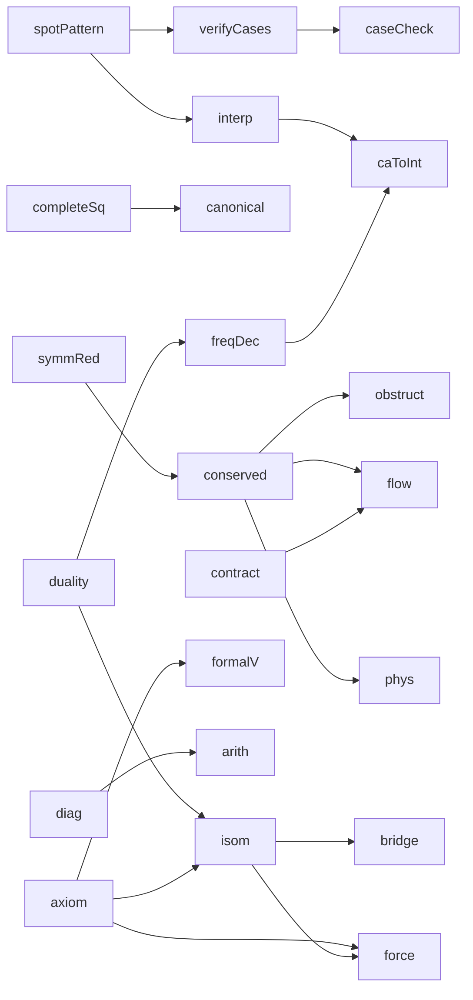
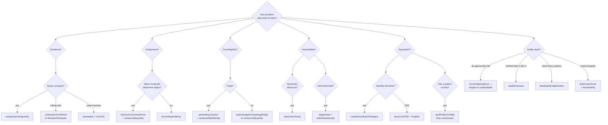

# 10. The Mathematician's Toolbox

## Techniques as functions, organized as a tree

Chapter 9 describes discovery techniques in prose. This chapter re-presents the same 27 techniques as a **structured toolbox** — a catalog you can browse like a standard library's documentation:

- Each technique has a **function signature** with declared inputs, process, outputs, preconditions, and postconditions.
- Techniques are organized as a **tree** (cluster → technique → sub-variant) and a **directed graph** (inheritance edges showing which techniques build on which).
- A **decision flowchart** at the end helps pick the right technique for a new problem.

Read this chapter as a reference, not linearly.

---

## 1. The tree of discovery

All 27 techniques grouped under the 10 clusters. Each leaf is a callable tool.

```mermaid
flowchart TB
  ROOT((Mathematical<br/>Discovery))

  ROOT --> C1[Cluster 1<br/>Experimental &<br/>Numerical]
  ROOT --> C2[Cluster 2<br/>Algebraic<br/>Manipulation]
  ROOT --> C3[Cluster 3<br/>Symmetry &<br/>Invariants]
  ROOT --> C4[Cluster 4<br/>Approximation<br/>& Limits]
  ROOT --> C5[Cluster 5<br/>Abstraction &<br/>Axiomatization]
  ROOT --> C6[Cluster 6<br/>Topology &<br/>Obstruction]
  ROOT --> C7[Cluster 7<br/>Self-Reference<br/>& Impossibility]
  ROOT --> C8[Cluster 8<br/>Iteration &<br/>Fixed Points]
  ROOT --> C9[Cluster 9<br/>Cross-Field<br/>Transfer]
  ROOT --> C10[Cluster 10<br/>Computer &<br/>Collaboration]

  C1 --> spotPattern[spotPatternInTable]
  C1 --> verifyCases[verifyOnSpecialCases]

  C2 --> completeSq[completeTheSquare]
  C2 --> canonical[reduceToCanonicalForm]
  C2 --> compose[composeWithIdentity]

  C3 --> symmRed[symmetryReduction]
  C3 --> conserved[conservedQuantity]
  C3 --> duality[duality]

  C4 --> exhaust[exhaustionSqueeze]
  C4 --> interp[interpolateAndContinue]
  C4 --> freqDec[frequencyDecomposition]

  C5 --> axiom[axiomatizeFromInstances]
  C5 --> isom[structuralIsomorphism]

  C6 --> raiseDim[raiseDimension]
  C6 --> obstruct[obstructionClass]
  C6 --> compact[compactnessArgument]

  C7 --> diag[diagonalize]
  C7 --> arith[arithmetizeSyntax]
  C7 --> force[forceIndependence]

  C8 --> contract[contractionFixedPoint]
  C8 --> descent[infiniteDescent]
  C8 --> flow[flowWithSurgery]

  C9 --> phys[physicsToPDE]
  C9 --> caToInt[complexAnalysisToIntegers]
  C9 --> bridge[analysisAlgebraTopologyBridge]

  C10 --> caseCheck[finiteCaseCheck]
  C10 --> formalV[formalVerify]
  C10 --> distrib[distributedCollaboration]
```



---

## 2. Function dictionary

Every technique is listed below with a uniform schema:

```
name(inputs) → outputs
  category:  which cluster
  preconds:  what must be true to apply
  process:   ordered steps
  postconds: what is produced / guaranteed
  inherits:  other techniques this depends on
  examples:  historical theorems that used it
```

---

### Cluster 1 — Experimental & Numerical

#### `spotPatternInTable(data) → conjecture`
- **category:** Cluster 1 · experimental
- **preconds:** you can enumerate or compute enough examples to form a table
- **process:**
  1. Compute `f(n)` or measure `P(instance)` for as many inputs as feasible.
  2. Stare at the table; compute ratios, differences, logs, second differences.
  3. Guess a closed form or asymptotic; round to nearby known constants.
  4. Verify the guess on inputs not used to derive it.
- **postconds:** a named conjecture `C` with concrete numerical agreement to *k* decimals.
- **inherits:** — (foundational)
- **examples:** Aryabhata's sine table via second-difference recurrence (Ch. 1); Gauss's π(x) ≈ x/ln(x) from prime tables (Ch. 4); Euler's Basel sum 1.6449… → π²/6 (Ch. 3); Gauss's quadratic reciprocity (Ch. 3); Kepler's T² ∝ a³ from Tycho's data (Ch. 2).

#### `verifyOnSpecialCases(conjecture) → refinedConjecture | counterexample`
- **category:** Cluster 1 · experimental
- **preconds:** a conjecture `C` you can test on small / extremal / symmetric instances.
- **process:**
  1. Enumerate special cases: small n, symmetric n, extreme parameters.
  2. For each, test `C`; if it fails, try to modify `C` to accommodate.
  3. Attempt proof on the easiest special case; the proof technique may generalize.
- **postconds:** either refined `C'` with proof of special cases or a counterexample.
- **inherits:** `spotPatternInTable`
- **examples:** FLT for n = 4 (Fermat) → n = 3 (Euler) → n = 5, 7 → Kummer's regular primes → eventual Wiles (Chs. 2, 6); Kepler conjecture — local 2D case by Thue before Hales's 3D (Ch. 6); Goldbach numerical verification to 10³⁰ before Helfgott (Ch. 6).

---

### Cluster 2 — Algebraic Manipulation

#### `completeTheSquare(equation, auxiliary) → solvedEquation`
- **category:** Cluster 2 · algebra
- **preconds:** equation with a quadratic-like imbalance; access to field operations and square roots.
- **process:**
  1. Identify the "almost-square" term and the imbalance.
  2. Add (to both sides) a term that makes the LHS a perfect square.
  3. Take square roots; solve the resulting linear equation.
  4. Generalization: if one auxiliary doesn't suffice (cubic, quartic), introduce a parameter and choose it to force a perfect square on both sides.
- **postconds:** explicit closed-form solution via radicals.
- **inherits:** —
- **examples:** Al-Khwārizmī's quadratic classification (Ch. 1); Cardano's depressed cubic, substitution t = u+v with uv = −p/3 (Ch. 2); Ferrari's quartic via resolvent cubic (Ch. 2); Lagrange's mean value theorem — modify f to match endpoints, apply Rolle (Ch. 3).

#### `reduceToCanonicalForm(object, equivalence) → canonicalRep`
- **category:** Cluster 2 · algebra
- **preconds:** an equivalence relation preserving the property you care about.
- **process:**
  1. Apply changes of basis / substitutions to simplify `object`.
  2. Reach a normal form with the fewest free parameters.
  3. Prove the theorem for the normal form.
  4. Translate the result back via the inverse change of basis.
- **postconds:** theorem on `object` via normal-form representative.
- **inherits:** `completeTheSquare` (special case)
- **examples:** Jordan normal form over ℂ (Ch. 7 catalog); Sylvester's law of inertia for real quadratic forms (Ch. 7 catalog); Hahn–Banach extension within a sublinear-bounded interval (Ch. 5); depressed cubic / quartic (Ch. 2).

#### `composeWithIdentity(elements, identity) → newElement`
- **category:** Cluster 2 · algebra
- **preconds:** an algebraic identity showing property P is closed under a binary operation.
- **process:**
  1. Verify the identity on one or two levels.
  2. Given two instances of P, combine them via the identity.
  3. Iterate — build a semigroup/monoid of P-instances.
  4. Reduce a general case to a base case via composition.
- **postconds:** general P-statement proved by reducing to primes or generators.
- **inherits:** —
- **examples:** Diophantus–Brahmagupta two-square identity (Ch. 2); Brahmagupta's *bhāvanā* and Bhāskara's *chakravāla* (Ch. 1); Euler's four-square identity used in Lagrange's proof (Ch. 3); Euler product ∏(1 − p⁻ˢ)⁻¹ = Σ 1/nˢ (Ch. 3).

---

### Cluster 3 — Symmetry & Invariants

#### `symmetryReduction(configuration, group G) → orbitRepresentative`
- **category:** Cluster 3 · symmetry
- **preconds:** a group `G` acts on your configuration; the property you want is `G`-invariant.
- **process:**
  1. Identify the symmetry group `G`.
  2. Pass to orbit representatives `config / G`.
  3. Prove the theorem on representatives.
  4. Lift back to arbitrary configurations via `G`.
- **postconds:** theorem on all `G`-equivalent configurations.
- **inherits:** —
- **examples:** Thales via isosceles-twice (Ch. 1); Archimedes' sphere via rotational slices (Ch. 1); Brahmagupta's orthodiagonal quadrilateral (Ch. 1); Noether's theorem — Lie-group action on action integral (Ch. 5).

#### `conservedQuantity(system, transformation) → invariantI`
- **category:** Cluster 3 · symmetry
- **preconds:** an object or process with allowed transformations.
- **process:**
  1. Find a quantity `I` that is unchanged under the transformation.
  2. Prove invariance by checking on generators.
  3. Objects with distinct `I` cannot be equivalent; sum of local `I`s = global constant.
- **postconds:** classification or constraint by `I`.
- **inherits:** `symmetryReduction`
- **examples:** Euler's V − E + F = 2 (Ch. 3); Descartes' angular defect summing to 4π (Ch. 2); Gauss's Theorema Egregium — K is intrinsic (Ch. 4); Noether currents — energy, momentum, charge (Ch. 5); Gauss–Bonnet ∫K dA = 2π·χ (Ch. 4); Atiyah–Singer index = topological index (Ch. 6).

#### `duality(category C, category D) → equivalenceCD`
- **category:** Cluster 3 · symmetry
- **preconds:** two theories with a contravariant structure-preserving correspondence.
- **process:**
  1. Establish the correspondence on objects and morphisms.
  2. Verify it reverses arrows and preserves composition.
  3. Translate a problem from `C` to `D`; solve there; translate back.
- **postconds:** a theorem in one theory yields a theorem in the dual theory.
- **inherits:** —
- **examples:** Menelaus ↔ Ceva (Chs. 1, 7); Desargues ↔ Pascal (Ch. 2); Galois correspondence (Ch. 4); Stone duality (Ch. 5); Gelfand–Naimark (Ch. 7); Poincaré duality Hᵏ ↔ H_{n−k} (Ch. 7); Fourier transform pair.

---

### Cluster 4 — Approximation & Limits

#### `exhaustionSqueeze(target, lower, upper) → exactValue`
- **category:** Cluster 4 · approximation
- **preconds:** you can produce sequences `Lₙ ≤ target ≤ Uₙ` where both `Lₙ`, `Uₙ` converge.
- **process:**
  1. Construct inscribed (lower) and circumscribed (upper) approximants.
  2. Show `Uₙ − Lₙ → 0`.
  3. Conclude `target = lim Lₙ = lim Uₙ`.
  4. Variant: bisection — halve the interval containing the target, iterate.
- **postconds:** exact value or closed form.
- **inherits:** —
- **examples:** Archimedes' circle area and sphere volume via 96-gons (Ch. 1); Bolzano–Weierstrass bisection (Ch. 4); Weierstrass approximation — polynomial squeeze in sup-norm (Ch. 4); Riemann integrability.

#### `interpolateAndContinue(formulaOnN) → formulaOnC`
- **category:** Cluster 4 · approximation
- **preconds:** a formula known for integer arguments you'd like to extend.
- **process:**
  1. Identify a smooth functional recurrence the integer values satisfy.
  2. Pick an interpolation method (falling factorials, ratios, limits).
  3. Extend to real/complex arguments where it still converges.
  4. If the domain has natural boundaries, analytically continue via functional equation.
- **postconds:** extended formula valid on a larger domain.
- **inherits:** `spotPatternInTable`
- **examples:** Wallis's π/2 product from ∫(1−x²)ⁿ dx at n=1/2 (Ch. 2); Newton's generalized binomial C(r, k) (Ch. 2); Taylor series via derivatives-as-shrunken-differences (Ch. 3); Euler's Γ function; Riemann ζ(s) continued from Re(s) > 1 to all of ℂ \ {1} (Ch. 4).

#### `frequencyDecomposition(function) → {modes, coefficients}`
- **category:** Cluster 4 · approximation
- **preconds:** a complete orthogonal basis (sinusoids, characters, spherical harmonics).
- **process:**
  1. Project `f` onto each basis element via inner product.
  2. Manipulate mode-by-mode (differentiation and integration decouple).
  3. Reassemble via inverse transform.
- **postconds:** problem reduces to algebra on coefficients.
- **inherits:** `duality` (Fourier pair is a duality)
- **examples:** de Moivre's (cos θ + i sin θ)ⁿ (Ch. 3); Euler's e^(iθ) = cos θ + i sin θ (Ch. 3); Fourier series for heat equation (Ch. 4); Laplace's CLT via characteristic functions (Ch. 3); Plancherel L² isometry (Ch. 7).

---

### Cluster 5 — Abstraction & Axiomatization

#### `axiomatizeFromInstances(instances[]) → axiomSystemA`
- **category:** Cluster 5 · abstraction
- **preconds:** multiple concrete phenomena sharing structural features.
- **process:**
  1. List the shared operations and laws across instances.
  2. State them as bare axioms.
  3. Prove theorems from the axioms alone.
  4. Every instance inherits all theorems for free.
- **postconds:** a general theory; each concrete case becomes a corollary.
- **inherits:** —
- **examples:** Euclid's *Elements* (Ch. 1); al-Khwārizmī's six canonical quadratic types (Ch. 1); Hilbert's basis theorem — abstract Noetherian condition (Ch. 5); Noether's isomorphism theorems (Ch. 5); Banach spaces — complete normed vector space (Ch. 5); Zermelo–Fraenkel set theory (Ch. 5).

#### `structuralIsomorphism(theory T1, theory T2) → bridge`
- **category:** Cluster 5 · abstraction
- **preconds:** two unrelated-looking theories with a structural correspondence.
- **process:**
  1. Identify the objects and morphisms in each.
  2. Construct a functor (or equivalence) between them.
  3. Transport a hard theorem in `T1` to an easier problem in `T2`.
- **postconds:** theorems on both sides.
- **inherits:** `duality`, `axiomatizeFromInstances`
- **examples:** Galois correspondence subgroups ↔ subfields (Ch. 4); Stone representation — Boolean algebras ↔ Stone spaces (Ch. 5); Gelfand–Naimark — C*-algebras ↔ LCH spaces (Ch. 7); Taniyama–Shimura–Wiles modularity — elliptic curves ↔ modular forms (Ch. 6); Grothendieck's Spec — rings ↔ affine schemes.

---

### Cluster 6 — Topology & Obstruction

#### `raiseDimension(problem, +k dims) → problemInHigherSpace`
- **category:** Cluster 6 · topology
- **preconds:** a problem resistant in dimension `n` but tractable when embedded higher.
- **process:**
  1. Embed or extend the problem into dim `n + k` with added structure.
  2. Solve in the higher-dimensional ambient.
  3. Project or restrict the solution back to dim `n`.
- **postconds:** theorem in original dimension, proved via detour.
- **inherits:** —
- **examples:** Desargues 2D theorem proved in 3D (Ch. 2); Gauss's FTA via two real curves in ℝ² crossing (Ch. 3); Faltings — curves via their Jacobian abelian varieties (Ch. 6); Wiles — elliptic curve via its Galois representation (Ch. 6); Perelman — 3-manifolds deformed in infinite-dim metric space (Ch. 6).

#### `obstructionClass(target, invariant) → possibilityOrForbidden`
- **category:** Cluster 6 · topology
- **preconds:** a topological/algebraic invariant that must vanish for the construction to exist.
- **process:**
  1. Define the invariant (degree, characteristic class, Galois group, minor).
  2. Compute it; if nonzero, the construction is impossible.
  3. Often the *impossibility* is the theorem.
- **postconds:** either a construction or a provable obstruction.
- **inherits:** `conservedQuantity`
- **examples:** Brouwer no-retraction — degree(identity S^n) ≠ 0 (Ch. 5); hairy-ball theorem χ(S²) = 2 (Ch. 7); Abel–Ruffini — A₅ non-solvable blocks radical formulas (Ch. 4); Wagner/Robertson–Seymour forbidden minors (Ch. 6).

#### `compactnessArgument(space) → convergentLimit`
- **category:** Cluster 6 · topology
- **preconds:** a topological space with some form of compactness.
- **process:**
  1. Take a sequence / net / ultrafilter in the space.
  2. Extract a convergent subsequence / accumulation point.
  3. Show the limit has the desired property (closed conditions pass to limits).
- **postconds:** existence of an extremal / limit object.
- **inherits:** —
- **examples:** Bolzano–Weierstrass (Ch. 4); Heine–Borel (Ch. 7); Tychonoff (Ch. 5); Banach–Alaoglu (Ch. 7); Montel's theorem underlying Riemann mapping (Ch. 4); compactness theorem in first-order logic (Ch. 7).

---

### Cluster 7 — Self-Reference & Impossibility

#### `diagonalize(enumerationOfF) → newElement ∉ enumeration`
- **category:** Cluster 7 · self-reference
- **preconds:** an alleged enumeration `f₁, f₂, …` of all objects of type T.
- **process:**
  1. For each `fₙ`, identify its "n-th component."
  2. Construct a new object `g` differing from `fₙ` at component `n`, for every `n`.
  3. `g` is of type T but not in the enumeration — contradiction.
- **postconds:** non-enumerability, uncomputability, or undecidability.
- **inherits:** —
- **examples:** Cantor's uncountability of ℝ (Ch. 4); Gödel's G = "this sentence is unprovable" (Ch. 5); Turing's halting theorem — `D(⟨D⟩)` contradicts itself (Ch. 5); Rice's theorem (Ch. 7); Cantor–Bernstein–Schröder-adjacent constructions.

#### `arithmetizeSyntax(formalSystem) → encodingPhi`
- **category:** Cluster 7 · self-reference
- **preconds:** a formal system capable of primitive recursion.
- **process:**
  1. Assign each symbol a number; encode formulas and proofs via prime factorization.
  2. Express syntactic predicates (`isProof(p, s)`) as arithmetic predicates.
  3. Use a fixed-point / substitution lemma to build self-referential sentences.
- **postconds:** syntax becomes an object of arithmetic; self-reference is formal.
- **inherits:** `diagonalize`
- **examples:** Gödel numbering (Ch. 5); universal Turing machine — machines as data on tape (Ch. 5); Matiyasevich/MRDP — c.e. sets are Diophantine (Ch. 7); Cook–Levin — NP computations as SAT (Ch. 7).

#### `forceIndependence(theory T, statement S) → modelsProAndCon`
- **category:** Cluster 7 · self-reference
- **preconds:** a consistent formal theory; a statement you suspect it cannot decide.
- **process:**
  1. Build an inner model (Gödel-style L) where `S` holds.
  2. Build an extension (Cohen-style forcing) where `¬S` holds.
  3. Both being models of `T` shows `S` is independent of `T`.
- **postconds:** `S ⊥ T` — proved unprovable in either direction.
- **inherits:** `axiomatizeFromInstances`, `structuralIsomorphism`
- **examples:** Gödel's constructible universe L — Con(ZF) ⇒ Con(ZFC + GCH) (Ch. 5); Cohen's forcing — Con(ZF) ⇒ Con(ZF + ¬CH) (Ch. 6); Solovay's model of ZF + "every set is measurable" (Ch. 7).

---

### Cluster 8 — Iteration & Fixed Points

#### `contractionFixedPoint(T on complete space X) → uniqueFixedPoint`
- **category:** Cluster 8 · iteration
- **preconds:** complete metric space; self-map that strictly shrinks distances (`d(Tx, Ty) ≤ k·d(x,y)` with `k < 1`).
- **process:**
  1. Start with any `x₀`.
  2. Iterate `xₙ₊₁ = T(xₙ)`.
  3. Sequence is Cauchy; converges by completeness.
  4. Limit is the unique fixed point.
- **postconds:** existence + uniqueness + constructive approximation.
- **inherits:** —
- **examples:** Banach fixed-point theorem (Ch. 5); Picard–Lindelöf existence for ODEs (Ch. 7); Newton's method (classical); implicit function theorem; Nash equilibrium via Kakutani (Ch. 7).

#### `infiniteDescent(claim) → contradiction`
- **category:** Cluster 8 · iteration
- **preconds:** a property with a natural integer measure; a mechanism to reduce.
- **process:**
  1. Assume a counterexample exists; pick one with *minimal* measure.
  2. Construct a strictly smaller counterexample from it.
  3. Contradicts minimality — hence no counterexample exists.
- **postconds:** negative existence statement.
- **inherits:** —
- **examples:** Euclid's infinitude of primes — extend any finite list (Ch. 1); Fermat's two-square theorem — descent on `m·p = a² + b² + 1² + 0²` (Ch. 2); Fermat's FLT for n = 4 on `x⁴ + y⁴ = z²` (Ch. 2); Bhāskara's *chakravāla* — monotone decrease of `|k|` (Ch. 1); Lagrange's four-square theorem (Ch. 3); Kummer's ideal-theoretic descent.

#### `flowWithSurgery(initial, flowEquation) → longTimeStructure`
- **category:** Cluster 8 · iteration
- **preconds:** a parabolic PDE or evolution equation on your object.
- **process:**
  1. Evolve the object by the flow `∂/∂t` equation.
  2. When singularities form at finite time, classify them.
  3. Cut out singular regions; reglue; continue the flow.
  4. Monitor a monotone quantity (entropy, reduced volume) to control singularities.
- **postconds:** long-time-limit classification or decomposition.
- **inherits:** `contractionFixedPoint`, `conservedQuantity` (monotone monitor)
- **examples:** Perelman's Ricci flow with surgery proving Poincaré + geometrization (Ch. 6); Weierstrass approximation by Gaussian convolution (heat flow smoothing) (Ch. 4); Bernstein polynomials via the law of large numbers (Ch. 4).

---

### Cluster 9 — Cross-Field Transfer

#### `physicsToPDE(phenomenon) → mathematicalFramework`
- **category:** Cluster 9 · transfer
- **preconds:** a physical phenomenon with modellable dynamics.
- **process:**
  1. Identify conserved quantities, boundary conditions, and governing equations.
  2. Formulate a PDE or variational principle.
  3. The PDE outlives the physics — it applies in pure mathematics.
- **postconds:** a technique transferable to problems with no physical origin.
- **inherits:** `conservedQuantity`
- **examples:** Fourier's heat equation → Fourier series (Ch. 4); Gauss's Hanover survey → intrinsic curvature (Ch. 4); Green's electromagnetism → vector-calculus identity (Ch. 4); Noether's GR problem → symmetry-conservation correspondence (Ch. 5); Torricelli fluid efflux → Bernoulli's principle (Ch. 2); Brownian motion → martingale / Black–Scholes.

#### `complexAnalysisToIntegers(arithmeticFunction Q) → asymptoticForQ`
- **category:** Cluster 9 · transfer
- **preconds:** an arithmetic function `Q(n)` you want to understand in aggregate.
- **process:**
  1. Encode as a Dirichlet series `Σ Q(n)/nˢ` or generating function.
  2. Extend by analytic continuation to a meromorphic function on ℂ.
  3. Locate poles and zeros; use Perron's formula or contour integration.
  4. Shift the contour; residues become the asymptotic.
- **postconds:** asymptotic for partial sums of `Q`.
- **inherits:** `interpolateAndContinue`, `frequencyDecomposition`
- **examples:** Dirichlet's primes in APs via L-functions (Ch. 7); Riemann's 1859 memoir (Ch. 4); Prime Number Theorem — zeta non-vanishing on Re(s) = 1 (Ch. 4); Helfgott's weak Goldbach via circle method (Ch. 6).

#### `analysisAlgebraTopologyBridge(problem in one field) → reformulationInAnother`
- **category:** Cluster 9 · transfer
- **preconds:** a problem stuck in one field; another field has a functorial view.
- **process:**
  1. Translate via a categorical or geometric correspondence.
  2. Solve in the new field, where structure is richer.
  3. Translate answer back.
- **postconds:** theorem in the original field via the translation.
- **inherits:** `structuralIsomorphism`
- **examples:** Atiyah–Singer — analytic index = topological index (Ch. 6); Riemann–Roch — sheaf cohomology = Euler characteristic (Ch. 4); Faltings's Mordell — heights + Galois reps (Ch. 6); Wiles's FLT — Frey curve + level-lowering + R=T (Ch. 6); Green–Tao transference — Szemerédi + sieve (Ch. 6).

---

### Cluster 10 — Computer-Assisted & Collaborative

#### `finiteCaseCheck(problem, reducibility) → machineVerifiedProof`
- **category:** Cluster 10 · delegation
- **preconds:** a theoretical reduction of your problem to a finite (possibly huge) list of cases.
- **process:**
  1. Prove: if each of cases `C₁, …, Cₙ` satisfies property P, the full theorem holds.
  2. Code and machine-check each `Cᵢ`.
  3. Aggregate certificates.
- **postconds:** theorem proved pending trust in the machine check.
- **inherits:** `verifyOnSpecialCases` (generalized to finite-but-enormous)
- **examples:** Four Color Theorem — ~1,500 reducible configurations (Ch. 6); Kepler conjecture — ~100,000 nonlinear programs (Ch. 6); Robertson–Seymour consequence — cubic-time decidability of minor-closed properties (Ch. 6).

#### `formalVerify(proofInProverLanguage) → machineCheckedCertificate`
- **category:** Cluster 10 · delegation
- **preconds:** a prose proof and a theorem-prover (Coq, Lean, Isabelle/HOL).
- **process:**
  1. Encode definitions and statements in the prover's logic.
  2. Translate each inferential step into formal tactics.
  3. The prover kernel checks every rule.
- **postconds:** certainty at the level of the kernel; independent of human review.
- **inherits:** `axiomatizeFromInstances`
- **examples:** Flyspeck — Kepler conjecture in HOL Light / Isabelle (Ch. 6); Gonthier's Coq Four Color Theorem (Ch. 6); Gonthier's Feit–Thompson odd-order theorem in Coq (Ch. 6); Lean mathlib at 200k+ theorems.

#### `distributedCollaboration(bigProblem, splitStrategy) → aggregateProof`
- **category:** Cluster 10 · delegation
- **preconds:** a problem decomposable into sub-tasks suitable for different specialists.
- **process:**
  1. Publish a roadmap or subproblem list.
  2. Distribute parts across a community.
  3. Maintain shared notation, lemmas, and version control.
  4. Aggregate via referees or an editor.
- **postconds:** theorem with attribution across many authors.
- **inherits:** —
- **examples:** Classification of Finite Simple Groups (~100 authors, ~10k pages) (Ch. 6); Modularity Theorem full case (Wiles → Diamond → CDT → BCDT) (Ch. 6); Polymath 8 reducing Zhang's bound to 246 (Ch. 6).

---

## 3. Inheritance graph

Edges point *from* a base technique *to* a technique that builds on it. Use this to see which techniques historically composed to yield modern methods.



**How to read:** a technique inherits the tools and mental model of its parents. `flowWithSurgery` (Perelman) inherits `contractionFixedPoint` (iterate a map) AND `conservedQuantity` (monotonic monitor) — surgery + entropy is the new ingredient added.

---

## 4. Decision flowchart — which technique to invoke

Start at the top; follow the arrows based on your problem.



---

## 5. Quick-reference table

All 27 techniques in one sortable view.

| # | Technique | Cluster | Input | Output | First major use | Modern use |
|---|---|---|---|---|---|---|
| 1 | spotPatternInTable | 1 | data table | conjecture | Aryabhata sin-table | Birch–Swinnerton-Dyer |
| 2 | verifyOnSpecialCases | 1 | conjecture | refined / counterexample | Fermat n=3,4 | Goldbach to 10³⁰ |
| 3 | completeTheSquare | 2 | unbalanced eqn | solved eqn | Al-Khwārizmī | resolvent tricks |
| 4 | reduceToCanonicalForm | 2 | messy object | normal form | Cardano depression | Jordan form |
| 5 | composeWithIdentity | 2 | two P-instances | new P-instance | Diophantus 2-sq | Euler product |
| 6 | symmetryReduction | 3 | configuration + G | orbit rep | Thales | Noether thm |
| 7 | conservedQuantity | 3 | system + transformation | invariant | Euler V-E+F | Atiyah–Singer |
| 8 | duality | 3 | category pair | equivalence | Menelaus↔Ceva | Gelfand–Naimark |
| 9 | exhaustionSqueeze | 4 | bounding sequences | exact value | Archimedes circle | Weierstrass approx |
| 10 | interpolateAndContinue | 4 | formula on ℕ | formula on ℂ | Wallis π/2 | Riemann ζ |
| 11 | frequencyDecomposition | 4 | function | modes+coeffs | de Moivre | Fourier analysis |
| 12 | axiomatizeFromInstances | 5 | instances | axiom system | Euclid | ZFC |
| 13 | structuralIsomorphism | 5 | T1 + T2 | bridge | Galois corresp | Modularity |
| 14 | raiseDimension | 6 | dim-n problem | dim-(n+k) solution | Desargues 2D→3D | Faltings |
| 15 | obstructionClass | 6 | target + invariant | possible/forbidden | Brouwer no-retract | forbidden minors |
| 16 | compactnessArgument | 6 | topological space | limit | Bolzano–Weierstrass | Banach–Alaoglu |
| 17 | diagonalize | 7 | enumeration | new element outside | Cantor uncountability | Turing halting |
| 18 | arithmetizeSyntax | 7 | formal system | encoding | Gödel numbering | Cook–Levin NP |
| 19 | forceIndependence | 7 | theory + statement | models ± S | Gödel's L | Cohen forcing |
| 20 | contractionFixedPoint | 8 | T on complete X | unique fixed pt | Banach FPT | Picard–Lindelöf |
| 21 | infiniteDescent | 8 | claim + measure | contradiction | Euclid primes | Kummer ideals |
| 22 | flowWithSurgery | 8 | PDE initial data | long-time structure | — | Perelman Ricci flow |
| 23 | physicsToPDE | 9 | phenomenon | PDE framework | Fourier heat | Noether |
| 24 | complexAnalysisToIntegers | 9 | arith function | asymptotic | Euler product | Prime Number Thm |
| 25 | analysisAlgebraTopologyBridge | 9 | problem in field | reformulation | Riemann–Roch | Wiles FLT |
| 26 | finiteCaseCheck | 10 | finite reduction | machine proof | Four Color Thm | Kepler / Hales |
| 27 | formalVerify | 10 | prose proof | kernel-checked | Flyspeck (2014) | Lean mathlib |
| 28 | distributedCollaboration | 10 | splittable problem | aggregate proof | CFSG | Polymath |

---

## 6. How to extend the toolbox

Techniques not yet listed but arguably worth adding as the toolbox grows:

- `probabilisticMethod(set, distribution) → existenceByPositiveProbability` — Erdős's technique; goes in a new cluster (Cluster 11: Probabilistic Arguments).
- `homologicalAlgebra(chainComplex) → invariants` — derived functors, spectral sequences; likely a new Cluster 12.
- `ultraproductTransfer(theoryOverFamily) → compactnessLikeResult` — non-standard analysis; fits Cluster 5 or a new one.
- `gröbnerBasis(idealGenerators) → canonicalGenerators` — computational algebra; extends `reduceToCanonicalForm`.
- `motivicBridge(arithmetic, geometry, topology)` — subsumes Cluster 9 in the long term.

To add a new technique, use the same schema: name, category, preconds, process, postconds, inherits, examples. If it merits its own cluster, extend the master tree in §1 and the decision flowchart in §4.

---

## 7. Using this as a discovery aid

When facing a new conjecture or problem:

1. **Browse the tree (§1)** — does your problem belong to a cluster?
2. **Check the decision flowchart (§4)** — what's the claim type?
3. **Read the function signature** of the candidate technique — do your inputs satisfy the preconditions?
4. **Check inheritance (§3)** — what does this technique depend on? If you can't execute a prerequisite, back up.
5. **Scan examples** — has anyone applied this technique to a *similar* problem? Their proof sketch is your starting template.
6. **If stuck, switch clusters** — the "meta-heuristic" from Ch. 9 still applies: most breakthroughs come from a cross-cluster combination (e.g., `raiseDimension` + `structuralIsomorphism` = Wiles).

The toolbox is not mechanical. The art of discovery is still in (i) recognizing which technique *fits*, (ii) supplying the specific new ingredient that no prior application supplied, and (iii) being willing to abandon a technique that's not working after honest effort. But knowing the full catalog gives you fewer blind spots.
